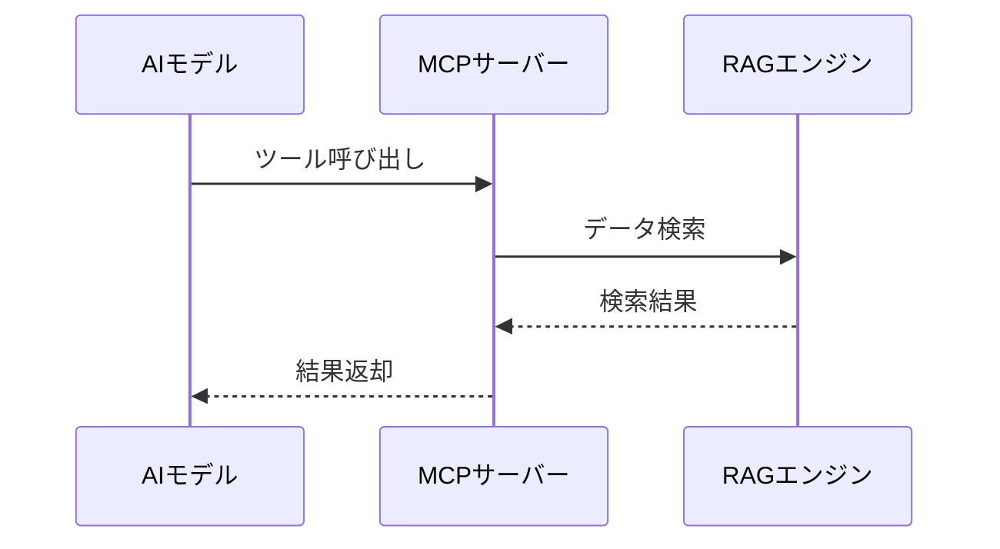

# CQM-MCP-XXX タイトル

## 1. 概要

### 1.1 目的

### 1.2 対象AIモデル

### 1.3 統合方針

## 2. MCP仕様

### 2.1 サーバー設定

```yaml
# cqm.yml
mcp:
  server:
    name: "CQ Models!"
    version: "1.0.0"
    capabilities:
      - 
```

### 2.2 ツール定義

#### ツール名: `toolName`

```typescript
interface ToolDefinition {
  name: "toolName";
  description: "ツールの説明";
  inputSchema: {
    type: "object";
    properties: {
      // パラメータ定義
    };
    required: string[];
  };
}
```

**実装:**
```typescript
async function handleTool(params: ToolParams): Promise<ToolResult> {
  // 実装詳細
}
```

## 3. アダプター設計

### 3.1 Claude Desktop統合

### 3.2 Cursor統合

### 3.3 汎用MCP統合

## 4. データフロー



## 5. エラーハンドリング

### 5.1 接続エラー

### 5.2 ツール実行エラー

### 5.3 タイムアウト処理

## 6. パフォーマンス最適化

## 7. テスト戦略

### 7.1 単体テスト

### 7.2 統合テスト

### 7.3 E2Eテスト

## 8. 変更履歴

| バージョン | 日付 | 変更内容 | 作成者 |
|-----------|------|----------|--------|
| v0.1-draft | {{date:YYYY-MM-DD}} | 初版作成 |  |