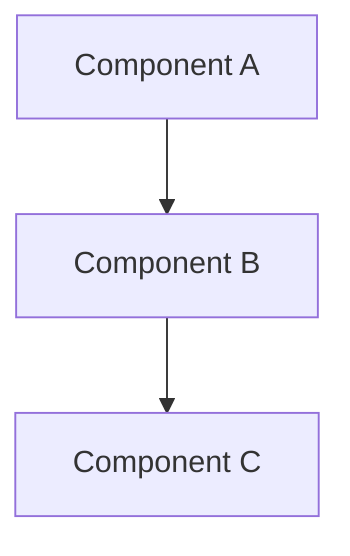

# CQM-TEC-XXX タイトル

## 1. 概要

### 1.1 目的

### 1.2 対象システム

### 1.3 設計方針

## 2. アーキテクチャ

### 2.1 システム構成



### 2.2 主要コンポーネント

#### コンポーネント名
- **役割**: 
- **責務**: 
- **技術**: 

## 3. データ設計

### 3.1 データ構造

```typescript
interface DataStructure {
  id: string;
  // 詳細定義
}
```

### 3.2 API仕様

#### エンドポイント名
- **Method**: GET/POST/PUT/DELETE
- **Path**: `/api/path`
- **Parameters**: 
- **Response**: 

## 4. 実装詳細

### 4.1 技術スタック

### 4.2 依存関係

### 4.3 設定

## 5. セキュリティ考慮事項

## 6. パフォーマンス考慮事項

## 7. エラーハンドリング

## 8. テスト方針

## 9. 変更履歴

| バージョン | 日付 | 変更内容 | 作成者 |
|-----------|------|----------|--------|
| v0.1-draft | {{date:YYYY-MM-DD}} | 初版作成 |  |