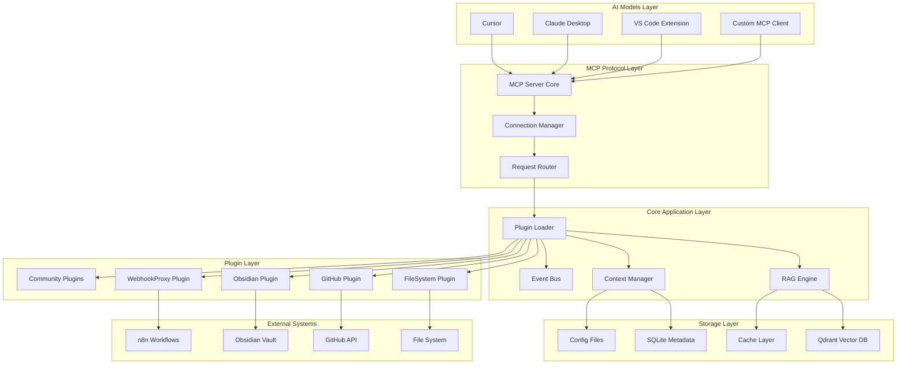
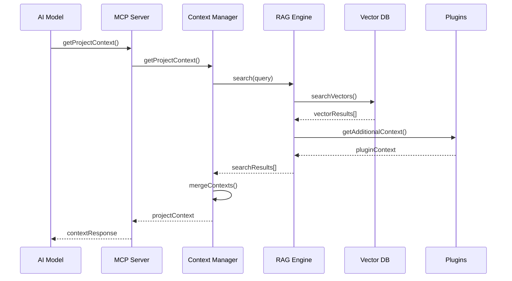
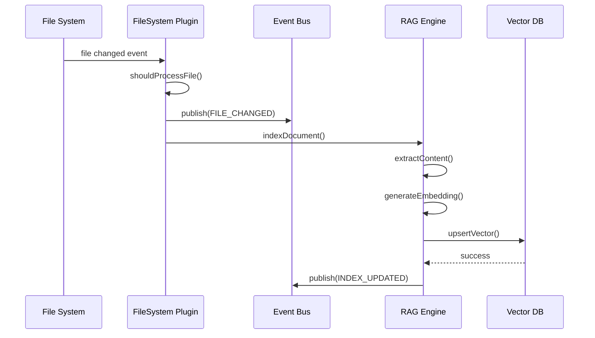
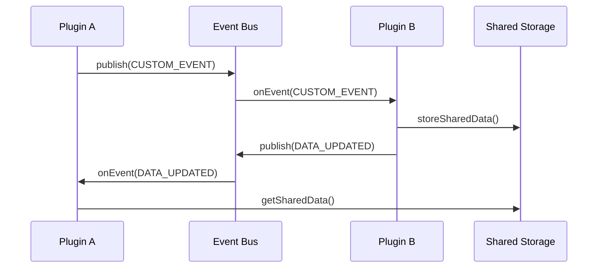

# CQM-ARC-001 システムアーキテクチャ

## 1. アーキテクチャ概要

### 1.1 設計原則

#### A. アマチュア無線メタファー
- **CQ (Calling All Models)**: 複数のAIモデルへの統一的な呼び出し
- **Clear Signal**: 明確で一貫性のあるコンテキスト配信
- **Universal Frequency**: すべてのAIモデルが同じ周波数で受信

#### B. 技術原則
1. **モジュラリティ**: プラグイン可能な疎結合アーキテクチャ
2. **スケーラビリティ**: 段階的拡張が可能な設計
3. **信頼性**: フォールバック機構を持つ堅牢性
4. **プライバシー**: ローカル実行によるデータ保護
5. **拡張性**: コミュニティ主導の機能拡張

### 1.2 全体構成



## 2. レイヤー詳細設計

### 2.1 AI Models Layer (接続層)

#### 目的
複数のAIモデルクライアントからのMCP接続を受け入れ、統一されたインターフェースを提供

#### コンポーネント

##### A. Model Adapters
```typescript
interface IModelAdapter {
  name: string;
  version: string;
  capabilities: ModelCapabilities;
  
  // 接続管理
  connect(config: AdapterConfig): Promise<Connection>;
  handleRequest(request: MCPRequest): Promise<MCPResponse>;
  
  // モデル固有の最適化
  optimizeContext(context: ProjectContext): OptimizedContext;
  getPreferredChunkSize(): number;
  getMaxTokens(): number;
}

interface ModelCapabilities {
  maxContextWindow: number;
  supportsStreaming: boolean;
  preferredChunkSize: number;
  supportedTools: string[];
}
```

##### B. 対応予定モデル
1. **Cursor Adapter**
   - VS Code統合
   - リアルタイムコード解析
   - IntelliSenseスタイルの提案

2. **Claude Desktop Adapter**
   - 標準MCPプロトコル
   - 長文コンテキスト活用
   - 対話型設計支援

3. **Generic MCP Adapter**
   - 標準プロトコル準拠
   - 将来のモデル対応基盤

### 2.2 MCP Protocol Layer (プロトコル層)

#### 目的
MCPプロトコルの実装とクライアント接続の管理

#### コンポーネント

##### A. MCP Server Core
```typescript
class MCPServerCore {
  private connectionManager: ConnectionManager;
  private requestRouter: RequestRouter;
  private toolRegistry: ToolRegistry;
  
  async start(config: ServerConfig): Promise<void>;
  async handleConnection(client: MCPClient): Promise<void>;
  async registerTool(tool: MCPTool): Promise<void>;
  async unregisterTool(toolName: string): Promise<void>;
}

interface ServerConfig {
  transport: 'stdio' | 'websocket' | 'http';
  maxConnections: number;
  timeout: number;
  logging: LogConfig;
}
```

##### B. Connection Manager
```typescript
class ConnectionManager {
  private connections: Map<string, MCPConnection>;
  private heartbeat: HeartbeatManager;
  
  async addConnection(client: MCPClient): Promise<string>;
  async removeConnection(clientId: string): Promise<void>;
  async broadcastEvent(event: SystemEvent): Promise<void>;
  getConnectionStats(): ConnectionStats;
}

interface MCPConnection {
  id: string;
  clientInfo: ClientInfo;
  connectedAt: Date;
  lastActivity: Date;
  capabilities: ClientCapabilities;
}
```

##### C. Request Router
```typescript
class RequestRouter {
  private toolHandlers: Map<string, ToolHandler>;
  private middleware: Middleware[];
  
  async routeRequest(request: MCPRequest): Promise<MCPResponse>;
  async addMiddleware(middleware: Middleware): Promise<void>;
  private async validateRequest(request: MCPRequest): Promise<boolean>;
  private async authorizeRequest(request: MCPRequest): Promise<boolean>;
}
```

### 2.3 Core Application Layer (コア層)

#### 目的
CQMの中核機能を提供し、プラグインとデータストアを統合管理

#### コンポーネント

##### A. Plugin Loader
```typescript
class PluginLoader {
  private plugins: Map<string, IPlugin>;
  private dependencies: DependencyGraph;
  private lifecycle: PluginLifecycle;
  
  async loadPlugin(pluginPath: string): Promise<void>;
  async unloadPlugin(pluginName: string): Promise<void>;
  async enablePlugin(pluginName: string): Promise<void>;
  async disablePlugin(pluginName: string): Promise<void>;
  
  getLoadedPlugins(): PluginInfo[];
  validateDependencies(): ValidationResult;
}

interface PluginInfo {
  name: string;
  version: string;
  status: 'loaded' | 'enabled' | 'disabled' | 'error';
  dependencies: string[];
  provides: string[];
}
```

##### B. RAG Engine
```typescript
class RAGEngine {
  private vectorStore: IVectorStore;
  private embeddingProvider: IOllamaEmbeddingProvider;
  private indexManager: IndexManager;
  private queryProcessor: QueryProcessor;
  
  async search(query: string, options?: SearchOptions): Promise<SearchResult[]>;
  async indexDocument(document: Document): Promise<void>;
  async deleteDocument(documentId: string): Promise<void>;
  async rebuildIndex(category?: string): Promise<void>;
  
  getIndexStats(): IndexStats;
  optimizeIndex(): Promise<void>;
}

// Ollama Embedding Provider Interface
interface IOllamaEmbeddingProvider {
  modelName: string;              // e.g., 'nomic-embed-text', 'mxbai-embed-large'
  dimensions: number;             // Model-specific dimensions
  maxTokens: number;              // Model-specific token limit
  
  async generateEmbedding(text: string): Promise<number[]>;
  async generateBatchEmbeddings(texts: string[]): Promise<number[][]>;
  async isModelAvailable(): Promise<boolean>;
  async getModelInfo(): Promise<OllamaModelInfo>;
}

interface OllamaModelInfo {
  name: string;
  size: string;
  format: string;
  family: string;
  parameter_size: string;
  quantization_level: string;
}

interface SearchOptions {
  category?: string;
  limit?: number;
  threshold?: number;
  includeMetadata?: boolean;
  timeRange?: TimeRange;
}

interface SearchResult {
  content: string;
  score: number;
  metadata: DocumentMetadata;
  highlights: string[];
}
```

##### C. Context Manager
```typescript
class ContextManager {
  private projectContext: ProjectContext;
  private sessionManager: SessionManager;
  private contextCache: LRUCache<string, CachedContext>;
  
  async getProjectContext(options?: ContextOptions): Promise<ProjectContext>;
  async updateProjectContext(updates: Partial<ProjectContext>): Promise<void>;
  async getTaskContext(taskId: string): Promise<TaskContext>;
  
  async mergeContexts(contexts: Context[]): Promise<MergedContext>;
  clearCache(): void;
}

interface ProjectContext {
  id: string;
  name: string;
  phase: ProjectPhase;
  techStack: TechStackInfo;
  currentTasks: TaskInfo[];
  recentChanges: ChangeInfo[];
  metadata: Record<string, any>;
}
```

##### D. Event Bus
```typescript
class EventBus {
  private subscribers: Map<string, EventHandler[]>;
  private eventHistory: EventHistory;
  
  async publish(event: SystemEvent): Promise<void>;
  async subscribe(eventType: string, handler: EventHandler): Promise<string>;
  async unsubscribe(subscriptionId: string): Promise<void>;
  
  getEventHistory(filter?: EventFilter): Event[];
  clearHistory(olderThan?: Date): void;
}

enum SystemEventType {
  FILE_CHANGED = 'file.changed',
  INDEX_UPDATED = 'index.updated',
  PLUGIN_LOADED = 'plugin.loaded',
  CLIENT_CONNECTED = 'client.connected',
  TASK_CREATED = 'task.created',
  CONTEXT_UPDATED = 'context.updated'
}
```

### 2.4 Plugin Layer (プラグイン層)

#### 目的
外部システムとの統合と機能拡張を提供

#### プラグインアーキテクチャ

##### A. Plugin Interface
```typescript
interface IPlugin {
  metadata: PluginMetadata;
  
  // ライフサイクル
  initialize(context: PluginContext): Promise<void>;
  start(): Promise<void>;
  stop(): Promise<void>;
  shutdown(): Promise<void>;
  
  // ツール提供
  getTools(): MCPTool[];
  
  // イベント処理
  onEvent(event: SystemEvent): Promise<void>;
  
  // 設定管理
  getConfigSchema(): JSONSchema;
  validateConfig(config: any): ValidationResult;
}

interface PluginContext {
  ragEngine: RAGEngine;
  contextManager: ContextManager;
  eventBus: EventBus;
  logger: ILogger;
  storage: IPluginStorage;
  config: PluginConfig;
}
```

##### B. 公式プラグイン仕様

###### FileSystem Plugin (Core)
```typescript
class FileSystemPlugin implements IPlugin {
  private watcher: FileWatcher;
  private indexer: FileIndexer;
  
  // ファイル監視とインデックス化
  async watchDirectory(path: string, options: WatchOptions): Promise<void>;
  async indexFile(filePath: string): Promise<void>;
  async handleFileChange(event: FileChangeEvent): Promise<void>;
  
  // 除外パターン管理
  shouldIgnoreFile(filePath: string): boolean;
  updateIgnorePatterns(patterns: string[]): void;
}

interface WatchOptions {
  recursive: boolean;
  ignorePatterns: string[];
  debounceMs: number;
  includeExtensions?: string[];
}
```

###### GitHub Plugin
```typescript
class GitHubPlugin implements IPlugin {
  private octokit: Octokit;
  private webhookServer: WebhookServer;
  private syncManager: GitHubSyncManager;
  
  // Issue/PR管理
  async syncIssues(repoConfig: RepoConfig): Promise<void>;
  async syncPullRequests(repoConfig: RepoConfig): Promise<void>;
  async handleWebhook(payload: WebhookPayload): Promise<void>;
  
  // Projects V2統合
  async syncProjects(): Promise<void>;
  async updateProjectItem(itemId: string, fields: ProjectFields): Promise<void>;
}
```

###### Obsidian Plugin
```typescript
class ObsidianPlugin implements IPlugin {
  private vaultWatcher: VaultWatcher;
  private markdownParser: MarkdownParser;
  
  // Vault監視
  async watchVault(vaultPath: string): Promise<void>;
  async parseMarkdown(content: string): Promise<ParsedMarkdown>;
  async extractLinks(content: string): Promise<WikiLink[]>;
  
  // 双方向リンク対応
  async buildLinkGraph(): Promise<LinkGraph>;
  async findBacklinks(noteId: string): Promise<Backlink[]>;
}
```

### 2.5 Storage Layer (ストレージ層)

#### 目的
データの永続化と効率的なアクセスを提供

#### コンポーネント

##### A. Vector Database (Qdrant)
```typescript
interface IVectorStore {
  async upsertVector(id: string, vector: number[], metadata: any): Promise<void>;
  async searchVectors(query: number[], limit: number, threshold?: number): Promise<VectorSearchResult[]>;
  async deleteVector(id: string): Promise<void>;
  async getCollectionInfo(): Promise<CollectionInfo>;
  async optimizeCollection(): Promise<void>;
}

class QdrantAdapter implements IVectorStore {
  private client: QdrantClient;
  private collectionName: string;
  
  async ensureCollection(): Promise<void>;
  async createIndex(fieldName: string): Promise<void>;
  async getStorageStats(): Promise<StorageStats>;
}
```

##### B. Metadata Database (SQLite)
```typescript
// Drizzle ORM Schema
export const documents = sqliteTable('documents', {
  id: text('id').primaryKey(),
  type: text('type').notNull(),
  category: text('category').notNull(),
  filePath: text('file_path'),
  content: text('content').notNull(),
  metadata: text('metadata', { mode: 'json' }),
  indexedAt: integer('indexed_at', { mode: 'timestamp' }).notNull(),
  updatedAt: integer('updated_at', { mode: 'timestamp' }).notNull(),
});

export const projects = sqliteTable('projects', {
  id: text('id').primaryKey(),
  name: text('name').notNull(),
  phase: text('phase').notNull(),
  techStack: text('tech_stack', { mode: 'json' }),
  metadata: text('metadata', { mode: 'json' }),
  createdAt: integer('created_at', { mode: 'timestamp' }).notNull(),
  updatedAt: integer('updated_at', { mode: 'timestamp' }).notNull(),
});
```

##### C. Cache Layer
```typescript
class CacheManager {
  private memoryCache: LRUCache<string, any>;
  private persistentCache: RedisClient;
  
  async get<T>(key: string): Promise<T | null>;
  async set<T>(key: string, value: T, ttl?: number): Promise<void>;
  async invalidate(pattern: string): Promise<void>;
  async getStats(): Promise<CacheStats>;
}
```

## 3. データフロー設計

### 3.1 コンテキスト取得フロー



### 3.2 ファイル変更処理フロー



### 3.3 プラグイン通信フロー



## 4. 非機能アーキテクチャ

### 4.1 パフォーマンス設計

#### A. レスポンス時間目標
- **コンテキスト取得**: < 100ms (通常) / < 500ms (初回・大容量)
- **インデックス更新**: < 500ms (単一ファイル) / < 30s (フルリビルド)
- **プラグイン起動**: < 5s
- **検索クエリ**: < 50ms (ベクトル検索)

#### B. 最適化戦略
```typescript
// キャッシュ戦略
class PerformanceOptimizer {
  // L1: メモリキャッシュ (LRU)
  private memoryCache: LRUCache<string, any>;
  
  // L2: SSDキャッシュ (永続化)
  private diskCache: DiskCache;
  
  // コンテキスト事前計算
  async precomputeContext(projectId: string): Promise<void>;
  
  // 段階的ローディング
  async loadContextByPriority(query: string): Promise<PartialContext>;
  
  // バッチ処理
  async batchIndexDocuments(documents: Document[]): Promise<void>;
}
```

#### C. メモリ管理
```typescript
interface MemoryLimits {
  maxHeapSize: string;          // "1GB"
  maxCacheSize: number;         // 100MB
  maxConcurrentConnections: number;  // 10
  maxPluginsLoaded: number;     // 20
}

class MemoryManager {
  private limits: MemoryLimits;
  private monitoring: MemoryMonitoring;
  
  async checkMemoryUsage(): Promise<MemoryStats>;
  async cleanupIfNeeded(): Promise<void>;
  async gracefulShutdown(): Promise<void>;
}
```

### 4.2 スケーラビリティ設計

#### A. 水平スケーリング制限
```typescript
interface ScalabilityLimits {
  maxFiles: number;              // 100,000 files
  maxTotalSize: string;          // "50GB"
  maxVectorDimensions: number;   // 768-4096 (Ollama embedding, model dependent)
  maxConcurrentQueries: number;  // 100
}
```

#### B. 段階的処理
```typescript
class ScalableProcessor {
  // ファイルサイズに応じた処理戦略
  async processDocument(doc: Document): Promise<void> {
    if (doc.size < 1024 * 100) {        // < 100KB
      return this.processSmallFile(doc);
    } else if (doc.size < 1024 * 1024) { // < 1MB
      return this.processLargeFile(doc);
    } else {                             // > 1MB
      return this.processHugeFile(doc);
    }
  }
  
  // チャンク分割戦略
  private async chunkDocument(content: string, maxChunkSize: number): Promise<Chunk[]>;
}
```

### 4.3 信頼性設計

#### A. エラーハンドリング階層
```typescript
enum ErrorSeverity {
  INFO = 'info',
  WARNING = 'warning',
  ERROR = 'error',
  FATAL = 'fatal'
}

class ErrorHandler {
  async handleError(error: Error, severity: ErrorSeverity): Promise<void> {
    switch (severity) {
      case ErrorSeverity.INFO:
        this.logInfo(error);
        break;
      case ErrorSeverity.WARNING:
        this.logWarning(error);
        break;
      case ErrorSeverity.ERROR:
        await this.attemptRecovery(error);
        break;
      case ErrorSeverity.FATAL:
        await this.gracefulShutdown(error);
        break;
    }
  }
  
  private async attemptRecovery(error: Error): Promise<void>;
  private async gracefulShutdown(error: Error): Promise<void>;
}
```

#### B. フォールバック機構
```typescript
class FallbackManager {
  // ベクトルDB接続失敗時
  async fallbackToLocalSearch(query: string): Promise<SearchResult[]>;
  
  // プラグイン障害時
  async isolateFailedPlugin(pluginName: string): Promise<void>;
  
  // 部分的サービス継続
  async enableDegradedMode(): Promise<void>;
}
```

### 4.4 セキュリティアーキテクチャ

#### A. 認証・認可
```typescript
class SecurityManager {
  private tokenValidator: TokenValidator;
  private accessControl: AccessControl;
  
  async authenticateClient(token: string): Promise<ClientIdentity>;
  async authorizeRequest(client: ClientIdentity, request: MCPRequest): Promise<boolean>;
  async auditRequest(client: ClientIdentity, request: MCPRequest): Promise<void>;
}

interface ClientIdentity {
  id: string;
  type: 'cursor' | 'claude' | 'generic';
  permissions: Permission[];
  metadata: ClientMetadata;
}
```

#### B. データ保護
```typescript
class DataProtection {
  // 機密データの暗号化
  async encryptSensitiveData(data: any): Promise<EncryptedData>;
  
  // アクセスログ
  async logAccess(clientId: string, resource: string): Promise<void>;
  
  // データマスキング
  async maskSensitiveContent(content: string): Promise<string>;
}
```

## 5. 運用アーキテクチャ

### 5.1 ログ・監視設計

#### A. ログ階層
```typescript
interface LogConfig {
  level: 'debug' | 'info' | 'warn' | 'error';
  outputs: LogOutput[];
  format: 'json' | 'text';
  rotation: LogRotation;
}

class LoggingSystem {
  // 構造化ログ
  info(message: string, metadata?: any): void;
  warn(message: string, metadata?: any): void;
  error(message: string, error?: Error, metadata?: any): void;
  
  // パフォーマンスログ
  logPerformance(operation: string, duration: number, metadata?: any): void;
  
  // 監査ログ
  audit(action: string, clientId: string, metadata?: any): void;
}
```

#### B. ヘルスチェック
```typescript
class HealthChecker {
  async checkSystemHealth(): Promise<HealthStatus> {
    return {
      status: 'healthy' | 'degraded' | 'unhealthy',
      components: {
        mcpServer: await this.checkMCPServer(),
        ragEngine: await this.checkRAGEngine(),
        vectorDB: await this.checkVectorDB(),
        plugins: await this.checkPlugins(),
      },
      timestamp: new Date(),
    };
  }
  
  private async checkComponent(name: string): Promise<ComponentHealth>;
}
```

### 5.2 設定管理

#### A. 設定階層
```yaml
# 設定の優先順位
1. 環境変数
2. .env.local
3. cqm.yml (プロジェクト固有)
4. ~/.cqm/config.yml (ユーザー設定)
5. /etc/cqm/config.yml (システム設定)
6. デフォルト値
```

#### B. 動的設定更新
```typescript
class ConfigManager {
  private config: ReloadableConfig;
  private watchers: ConfigWatcher[];
  
  async reloadConfig(): Promise<void>;
  async updateConfig(path: string, value: any): Promise<void>;
  async validateConfig(): Promise<ValidationResult>;
  
  onConfigChange(callback: (changes: ConfigChange[]) => void): string;
}
```

## 6. デプロイメント アーキテクチャ

### 6.1 パッケージ構成

```
@cqm/cli                 # メインCLIパッケージ
├── @cqm/core           # コアサーバー
├── @cqm/rag-engine     # RAGエンジン
├── @cqm/plugin-filesystem  # ファイルシステムプラグイン
├── @cqm/plugin-github      # GitHubプラグイン
├── @cqm/plugin-obsidian    # Obsidianプラグイン
└── @cqm/types          # 共通型定義
```

### 6.2 実行環境

#### A. 本番環境
```dockerfile
# Docker Compose構成
version: '3.8'
services:
  cqm-server:
    image: cqm/server:latest
    environment:
      - NODE_ENV=production
      - OLLAMA_HOST=http://ollama:11434
    volumes:
      - ./config:/app/config
      - ./data:/app/data
    depends_on:
      - qdrant
      - ollama
    
  qdrant:
    image: qdrant/qdrant:latest
    ports:
      - "6333:6333"
    volumes:
      - qdrant_data:/qdrant/storage
      
  ollama:
    image: ollama/ollama:latest
    ports:
      - "11434:11434"
    volumes:
      - ollama_data:/root/.ollama
    environment:
      - OLLAMA_HOST=0.0.0.0
```

#### B. 開発環境
```bash
# 開発サーバー起動
npm run dev           # 全サービス開発モード
npm run dev:server    # サーバーのみ
npm run dev:qdrant    # Qdrantのみ
npm run dev:ollama    # Ollamaのみ

# Ollamaモデル管理
npm run ollama:pull   # 推奨embeddingモデルをダウンロード
npm run ollama:list   # 利用可能モデル一覧

# テスト実行
npm test              # 全テスト
npm run test:unit     # ユニットテスト
npm run test:integration  # 統合テスト
```

## 7. Ollama統合特有の考慮事項

### 7.1 Embeddingモデル戦略
```typescript
// 推奨モデル選択ガイド
interface OllamaModelStrategy {
  // 高品質・高コスト
  highQuality: 'mxbai-embed-large';    // 1024 dimensions
  
  // バランス型（推奨）
  balanced: 'nomic-embed-text';        // 768 dimensions
  
  // 軽量・高速
  lightweight: 'all-minilm';           // 384 dimensions
}

class OllamaEmbeddingManager {
  async selectOptimalModel(projectSize: number): Promise<string> {
    if (projectSize < 1000) return 'all-minilm';
    if (projectSize < 10000) return 'nomic-embed-text';
    return 'mxbai-embed-large';
  }
  
  async ensureModelAvailable(modelName: string): Promise<void>;
  async warmupModel(modelName: string): Promise<void>;
}
```

### 7.2 パフォーマンス最適化
- **モデル事前読み込み**: サーバー起動時にembeddingモデルをメモリに展開
- **バッチ処理**: 複数テキストの一括embedding生成
- **キャッシュ戦略**: 同一テキストのembedding結果をキャッシュ
- **フォールバック**: Ollama接続失敗時のローカル検索機能

### 7.3 運用考慮事項
- **GPUメモリ管理**: embedding処理のGPU使用量監視
- **モデル更新**: 新しいembeddingモデルへの移行戦略
- **依存関係**: Ollamaサービスの可用性監視

## 8. 今後の拡張計画

### 8.1 Phase 1: エコシステム拡張
- コミュニティプラグインフレームワーク
- プラグインレジストリ
- 設定GUI (Web UI)
- 複数embeddingモデル対応

### 8.2 Phase 2: 高度機能
- 分散デプロイメント対応
- クラスタリング機能
- リアルタイム協調編集
- embedding品質自動最適化

### 8.3 Phase 3: エンタープライズ機能
- 多テナント対応
- 高度な認証・認可
- 企業ポリシー統合
- ハイブリッドembedding (Ollama + Cloud)

---

## 付録

### A. アーキテクチャ決定記録 (ADR)
- [ADR-001: Node.js/TypeScript選定](../10_Decisions/CQM-ADR-001_技術スタック選定.md)
- [ADR-002: MCPプロトコル採用](../10_Decisions/CQM-ADR-002_MCPプロトコル採用.md)
- [ADR-003: プラグインアーキテクチャ](../10_Decisions/CQM-ADR-003_プラグインアーキテクチャ.md)

### B. 参考資料
- [MCP公式仕様](https://modelcontextprotocol.io)
- [Qdrantアーキテクチャガイド](https://qdrant.tech/documentation/concepts/)
- [Node.js パフォーマンスガイド](https://nodejs.org/en/docs/guides/simple-profiling/)

---

*"Clear Signal, Universal Frequency - CQM Architecture Team"*