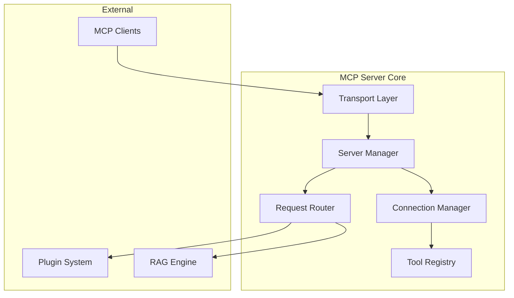

# CQM-TEC-001 コアモジュール設計

## 1. 概要

### 1.1 目的
CQMシステムのコア機能を構成するモジュールの詳細設計を定義し、Phase 0 Ultra-Minimal MVP実装の技術的基盤を提供する。

### 1.2 対象モジュール
- **MCP Server Core**: MCPプロトコル実装とクライアント管理
- **Plugin Loader**: プラグインシステムの中核
- **Configuration Manager**: 設定管理システム
- **Event Bus**: システム内イベント配信
- **Error Handler**: 統一エラー処理システム

### 1.3 設計原則
1. **単一責任**: 各モジュールは明確な責任範囲を持つ
2. **依存性注入**: テスタブルで疎結合な設計
3. **設定駆動**: 実行時設定による動作制御
4. **イベント駆動**: 非同期処理とプラグイン通信
5. **段階的拡張**: MVP → フル機能への拡張容易性

## 2. MCPサーバーコア

### 2.1 責任範囲
- MCPプロトコルの実装と管理
- クライアント接続の受け入れと管理
- リクエストルーティングとレスポンス管理
- ツール登録とライフサイクル管理

### 2.2 アーキテクチャ



### 2.3 詳細設計

#### A. Server Manager
```typescript
/**
 * MCPサーバーの全体管理を担当
 */
export class MCPServerManager {
  private config: ServerConfig;
  private connectionManager: ConnectionManager;
  private requestRouter: RequestRouter;
  private toolRegistry: ToolRegistry;
  private transportLayer: ITransportLayer;
  private isRunning = false;

  constructor(
    config: ServerConfig,
    pluginLoader: PluginLoader,
    eventBus: EventBus,
    logger: ILogger
  ) {
    this.config = config;
    this.connectionManager = new ConnectionManager(config.connection, eventBus, logger);
    this.requestRouter = new RequestRouter(eventBus, logger);
    this.toolRegistry = new ToolRegistry(pluginLoader, logger);
    this.transportLayer = this.createTransportLayer(config.transport);
  }

  /**
   * サーバー起動
   */
  async start(): Promise<void> {
    if (this.isRunning) {
      throw new Error('Server is already running');
    }

    try {
      // 1. コンポーネント初期化
      await this.toolRegistry.initialize();
      await this.connectionManager.initialize();
      await this.requestRouter.initialize();

      // 2. トランスポート層開始
      await this.transportLayer.start();

      // 3. クライアント接続受け入れ開始
      this.transportLayer.onConnection(this.handleConnection.bind(this));

      this.isRunning = true;
      this.logger.info('MCP Server started successfully', {
        transport: this.config.transport.type,
        maxConnections: this.config.connection.maxConnections
      });

    } catch (error) {
      this.logger.error('Failed to start MCP Server', error);
      throw error;
    }
  }

  /**
   * サーバー停止
   */
  async stop(): Promise<void> {
    if (!this.isRunning) {
      return;
    }

    try {
      // 1. 新規接続の受け入れ停止
      await this.transportLayer.stop();

      // 2. 既存接続の適切な終了
      await this.connectionManager.shutdown();

      // 3. コンポーネントのクリーンアップ
      await this.requestRouter.shutdown();
      await this.toolRegistry.shutdown();

      this.isRunning = false;
      this.logger.info('MCP Server stopped gracefully');

    } catch (error) {
      this.logger.error('Error during server shutdown', error);
      throw error;
    }
  }

  /**
   * 新規クライアント接続処理
   */
  private async handleConnection(transport: ITransport): Promise<void> {
    try {
      const connection = await this.connectionManager.addConnection(transport);
      
      // リクエスト処理の設定
      transport.onRequest(async (request: MCPRequest) => {
        return await this.requestRouter.routeRequest(request, connection);
      });

      // 切断処理の設定
      transport.onDisconnect(() => {
        this.connectionManager.removeConnection(connection.id);
      });

    } catch (error) {
      this.logger.error('Failed to handle new connection', error);
      transport.disconnect();
    }
  }
}
```

#### B. Connection Manager
```typescript
/**
 * クライアント接続の管理を担当
 */
export class ConnectionManager {
  private connections = new Map<string, MCPConnection>();
  private config: ConnectionConfig;
  private eventBus: EventBus;
  private logger: ILogger;
  private heartbeat: HeartbeatManager;

  constructor(config: ConnectionConfig, eventBus: EventBus, logger: ILogger) {
    this.config = config;
    this.eventBus = eventBus;
    this.logger = logger;
    this.heartbeat = new HeartbeatManager(config.heartbeat, logger);
  }

  async initialize(): Promise<void> {
    // ハートビート管理開始
    await this.heartbeat.start();
    
    // 定期的な接続状態チェック
    setInterval(() => {
      this.cleanupStaleConnections();
    }, this.config.cleanupIntervalMs);
  }

  /**
   * 新規接続の追加
   */
  async addConnection(transport: ITransport): Promise<MCPConnection> {
    // 接続数制限チェック
    if (this.connections.size >= this.config.maxConnections) {
      throw new Error(`Maximum connections exceeded: ${this.config.maxConnections}`);
    }

    // クライアント情報の取得
    const clientInfo = await this.identifyClient(transport);
    
    const connection: MCPConnection = {
      id: generateConnectionId(),
      transport,
      clientInfo,
      connectedAt: new Date(),
      lastActivity: new Date(),
      capabilities: await this.negotiateCapabilities(transport),
      metadata: {}
    };

    this.connections.set(connection.id, connection);
    
    // ハートビート監視開始
    this.heartbeat.monitor(connection);

    // イベント発行
    await this.eventBus.publish({
      type: 'client.connected',
      payload: { connectionId: connection.id, clientInfo }
    });

    this.logger.info('New client connected', {
      connectionId: connection.id,
      clientType: clientInfo.type,
      clientVersion: clientInfo.version
    });

    return connection;
  }

  /**
   * 接続の削除
   */
  async removeConnection(connectionId: string): Promise<void> {
    const connection = this.connections.get(connectionId);
    if (!connection) {
      return;
    }

    // ハートビート監視停止
    this.heartbeat.unmonitor(connectionId);

    // 接続削除
    this.connections.delete(connectionId);

    // イベント発行
    await this.eventBus.publish({
      type: 'client.disconnected',
      payload: { connectionId, clientInfo: connection.clientInfo }
    });

    this.logger.info('Client disconnected', {
      connectionId,
      duration: Date.now() - connection.connectedAt.getTime()
    });
  }

  /**
   * 接続統計取得
   */
  getConnectionStats(): ConnectionStats {
    const connections = Array.from(this.connections.values());
    
    return {
      totalConnections: connections.length,
      connectionsByType: this.groupByClientType(connections),
      averageConnectionTime: this.calculateAverageConnectionTime(connections),
      oldestConnection: this.findOldestConnection(connections),
      totalRequests: connections.reduce((sum, conn) => sum + (conn.metadata.requestCount || 0), 0)
    };
  }

  /**
   * クライアント識別
   */
  private async identifyClient(transport: ITransport): Promise<ClientInfo> {
    try {
      // MCPプロトコルのinitializeリクエストから情報取得
      const initRequest = await transport.waitForInitialize(5000);
      
      return {
        type: this.detectClientType(initRequest.params.clientInfo),
        name: initRequest.params.clientInfo.name,
        version: initRequest.params.clientInfo.version,
        capabilities: initRequest.params.capabilities
      };
    } catch (error) {
      this.logger.warn('Failed to identify client, using defaults', error);
      return {
        type: 'unknown',
        name: 'Unknown Client',
        version: '0.0.0',
        capabilities: {}
      };
    }
  }

  /**
   * クライアントタイプの検出
   */
  private detectClientType(clientInfo: any): ClientType {
    const name = clientInfo.name?.toLowerCase() || '';
    
    if (name.includes('cursor')) return 'cursor';
    if (name.includes('claude')) return 'claude';
    if (name.includes('vscode')) return 'vscode';
    
    return 'generic';
  }

  /**
   * 古い接続のクリーンアップ
   */
  private cleanupStaleConnections(): void {
    const now = Date.now();
    const staleThreshold = this.config.staleConnectionTimeoutMs;

    for (const [id, connection] of this.connections) {
      const timeSinceActivity = now - connection.lastActivity.getTime();
      
      if (timeSinceActivity > staleThreshold) {
        this.logger.warn('Removing stale connection', {
          connectionId: id,
          timeSinceActivity: timeSinceActivity
        });
        
        connection.transport.disconnect();
        this.removeConnection(id);
      }
    }
  }
}
```

#### C. Request Router
```typescript
/**
 * MCPリクエストのルーティングと処理を担当
 */
export class RequestRouter {
  private toolHandlers = new Map<string, ToolHandler>();
  private middleware: Middleware[] = [];
  private eventBus: EventBus;
  private logger: ILogger;
  private rateLimiter: RateLimiter;

  constructor(eventBus: EventBus, logger: ILogger) {
    this.eventBus = eventBus;
    this.logger = logger;
    this.rateLimiter = new RateLimiter({
      maxRequests: 100,
      windowMs: 60000 // 1分間に100リクエスト
    });
  }

  async initialize(): Promise<void> {
    // デフォルトミドルウェアの設定
    this.addMiddleware(new LoggingMiddleware(this.logger));
    this.addMiddleware(new ValidationMiddleware());
    this.addMiddleware(new AuthenticationMiddleware());
    this.addMiddleware(new RateLimitMiddleware(this.rateLimiter));
  }

  /**
   * リクエストルーティング
   */
  async routeRequest(request: MCPRequest, connection: MCPConnection): Promise<MCPResponse> {
    const startTime = Date.now();
    
    try {
      // ミドルウェア処理
      const context = await this.processMiddleware(request, connection);
      
      // ツールハンドラの取得
      const handler = this.toolHandlers.get(request.method);
      if (!handler) {
        throw new MCPError('Method not found', 'METHOD_NOT_FOUND', 404);
      }

      // リクエスト処理
      const result = await handler.handle(request.params, context);

      // 成功レスポンス
      const response: MCPResponse = {
        jsonrpc: '2.0',
        id: request.id,
        result
      };

      // メトリクス記録
      this.recordMetrics(request, response, Date.now() - startTime);

      return response;

    } catch (error) {
      // エラーレスポンス
      const mcpError = error instanceof MCPError 
        ? error 
        : new MCPError('Internal error', 'INTERNAL_ERROR', 500);

      this.logger.error('Request processing failed', {
        method: request.method,
        error: mcpError,
        duration: Date.now() - startTime
      });

      return {
        jsonrpc: '2.0',
        id: request.id,
        error: {
          code: mcpError.code,
          message: mcpError.message,
          data: mcpError.data
        }
      };
    }
  }

  /**
   * ツールハンドラの登録
   */
  registerToolHandler(method: string, handler: ToolHandler): void {
    this.toolHandlers.set(method, handler);
    this.logger.debug('Tool handler registered', { method });
  }

  /**
   * ミドルウェアの追加
   */
  addMiddleware(middleware: Middleware): void {
    this.middleware.push(middleware);
  }

  /**
   * ミドルウェア処理
   */
  private async processMiddleware(
    request: MCPRequest, 
    connection: MCPConnection
  ): Promise<RequestContext> {
    let context: RequestContext = {
      request,
      connection,
      metadata: {}
    };

    for (const middleware of this.middleware) {
      context = await middleware.process(context);
    }

    return context;
  }
}
```

### 2.4 型定義

```typescript
// 基本型定義
export interface ServerConfig {
  transport: TransportConfig;
  connection: ConnectionConfig;
  logging: LoggingConfig;
  security: SecurityConfig;
}

export interface ConnectionConfig {
  maxConnections: number;
  heartbeat: HeartbeatConfig;
  staleConnectionTimeoutMs: number;
  cleanupIntervalMs: number;
}

export interface MCPConnection {
  id: string;
  transport: ITransport;
  clientInfo: ClientInfo;
  connectedAt: Date;
  lastActivity: Date;
  capabilities: ClientCapabilities;
  metadata: Record<string, any>;
}

export interface ClientInfo {
  type: ClientType;
  name: string;
  version: string;
  capabilities: any;
}

export type ClientType = 'cursor' | 'claude' | 'vscode' | 'generic' | 'unknown';

// リクエスト関連
export interface MCPRequest {
  jsonrpc: '2.0';
  id: string | number;
  method: string;
  params?: any;
}

export interface MCPResponse {
  jsonrpc: '2.0';
  id: string | number;
  result?: any;
  error?: MCPError;
}

export interface RequestContext {
  request: MCPRequest;
  connection: MCPConnection;
  metadata: Record<string, any>;
}

// ツールハンドラー
export interface ToolHandler {
  handle(params: any, context: RequestContext): Promise<any>;
  validate?(params: any): ValidationResult;
  authorize?(context: RequestContext): Promise<boolean>;
}

// ミドルウェア
export interface Middleware {
  process(context: RequestContext): Promise<RequestContext>;
}
```

## 3. プラグインローダー

### 3.1 責任範囲
- プラグインの発見とロード
- 依存関係の解決と管理
- プラグインライフサイクルの管理
- プラグイン間通信の調整

### 3.2 設計

```typescript
/**
 * プラグインシステムの中核管理クラス
 */
export class PluginLoader {
  private plugins = new Map<string, LoadedPlugin>();
  private pluginConfigs = new Map<string, PluginConfig>();
  private dependencyGraph = new DependencyGraph();
  private eventBus: EventBus;
  private logger: ILogger;
  private config: PluginLoaderConfig;

  constructor(config: PluginLoaderConfig, eventBus: EventBus, logger: ILogger) {
    this.config = config;
    this.eventBus = eventBus;
    this.logger = logger;
  }

  /**
   * プラグインローダーの初期化
   */
  async initialize(): Promise<void> {
    // 設定からプラグイン設定を読み込み
    await this.loadPluginConfigs();
    
    // 有効なプラグインをロード
    await this.loadEnabledPlugins();
    
    // 依存関係を解決してプラグインを起動
    await this.startPluginsInOrder();

    this.logger.info('Plugin loader initialized', {
      totalPlugins: this.plugins.size,
      enabledPlugins: this.getEnabledPlugins().length
    });
  }

  /**
   * プラグインの動的ロード
   */
  async loadPlugin(pluginPath: string): Promise<void> {
    try {
      // プラグインファイルの解決
      const resolvedPath = this.resolvePluginPath(pluginPath);
      
      // プラグインモジュールの読み込み
      const pluginModule = await import(resolvedPath);
      const PluginClass = pluginModule.default || pluginModule.Plugin;
      
      if (!PluginClass) {
        throw new Error(`Plugin class not found in ${pluginPath}`);
      }

      // プラグインメタデータの検証
      const plugin = new PluginClass();
      this.validatePlugin(plugin);

      // 依存関係チェック
      await this.checkDependencies(plugin.metadata);

      // プラグインコンテキストの作成
      const context = this.createPluginContext(plugin.metadata.name);

      // プラグインの初期化
      await plugin.initialize(context);

      // ロード済みプラグインとして登録
      const loadedPlugin: LoadedPlugin = {
        instance: plugin,
        metadata: plugin.metadata,
        context,
        status: 'loaded',
        loadedAt: new Date()
      };

      this.plugins.set(plugin.metadata.name, loadedPlugin);
      this.dependencyGraph.addNode(plugin.metadata.name, plugin.metadata.dependencies || []);

      // イベント発行
      await this.eventBus.publish({
        type: 'plugin.loaded',
        payload: { pluginName: plugin.metadata.name, metadata: plugin.metadata }
      });

      this.logger.info('Plugin loaded successfully', {
        name: plugin.metadata.name,
        version: plugin.metadata.version
      });

    } catch (error) {
      this.logger.error('Failed to load plugin', { pluginPath, error });
      throw error;
    }
  }

  /**
   * プラグインの有効化
   */
  async enablePlugin(pluginName: string): Promise<void> {
    const plugin = this.plugins.get(pluginName);
    if (!plugin) {
      throw new Error(`Plugin not found: ${pluginName}`);
    }

    if (plugin.status === 'enabled') {
      return; // 既に有効
    }

    try {
      // 依存関係チェック
      const dependencies = plugin.metadata.dependencies || [];
      for (const dep of dependencies) {
        const depPlugin = this.plugins.get(dep);
        if (!depPlugin || depPlugin.status !== 'enabled') {
          throw new Error(`Dependency not enabled: ${dep}`);
        }
      }

      // プラグイン開始
      if (plugin.instance.start) {
        await plugin.instance.start();
      }

      // ツールの登録
      const tools = plugin.instance.getTools();
      for (const tool of tools) {
        await this.registerTool(tool, pluginName);
      }

      plugin.status = 'enabled';
      plugin.enabledAt = new Date();

      // イベント発行
      await this.eventBus.publish({
        type: 'plugin.enabled',
        payload: { pluginName, tools: tools.map(t => t.name) }
      });

      this.logger.info('Plugin enabled', {
        name: pluginName,
        toolsRegistered: tools.length
      });

    } catch (error) {
      plugin.status = 'error';
      plugin.lastError = error;
      this.logger.error('Failed to enable plugin', { pluginName, error });
      throw error;
    }
  }

  /**
   * プラグインの無効化
   */
  async disablePlugin(pluginName: string): Promise<void> {
    const plugin = this.plugins.get(pluginName);
    if (!plugin || plugin.status !== 'enabled') {
      return;
    }

    try {
      // 依存するプラグインの確認
      const dependents = this.dependencyGraph.getDependents(pluginName);
      if (dependents.length > 0) {
        throw new Error(`Cannot disable plugin with active dependents: ${dependents.join(', ')}`);
      }

      // ツールの登録解除
      const tools = plugin.instance.getTools();
      for (const tool of tools) {
        await this.unregisterTool(tool.name);
      }

      // プラグイン停止
      if (plugin.instance.stop) {
        await plugin.instance.stop();
      }

      plugin.status = 'disabled';

      // イベント発行
      await this.eventBus.publish({
        type: 'plugin.disabled',
        payload: { pluginName }
      });

      this.logger.info('Plugin disabled', { name: pluginName });

    } catch (error) {
      this.logger.error('Failed to disable plugin', { pluginName, error });
      throw error;
    }
  }

  /**
   * プラグイン情報の取得
   */
  getPluginInfo(): PluginInfo[] {
    return Array.from(this.plugins.values()).map(plugin => ({
      name: plugin.metadata.name,
      version: plugin.metadata.version,
      status: plugin.status,
      description: plugin.metadata.description,
      dependencies: plugin.metadata.dependencies || [],
      loadedAt: plugin.loadedAt,
      enabledAt: plugin.enabledAt,
      lastError: plugin.lastError?.message
    }));
  }

  /**
   * プラグインコンテキストの作成
   */
  private createPluginContext(pluginName: string): PluginContext {
    return {
      pluginName,
      eventBus: this.eventBus,
      logger: this.logger.child({ plugin: pluginName }),
      storage: new PluginStorage(pluginName, this.config.dataDirectory),
      config: this.pluginConfigs.get(pluginName) || {},
      // 他のプラグインへの参照は制限
      getPlugin: (name: string) => this.getPublicPluginInterface(name)
    };
  }

  /**
   * プラグインの検証
   */
  private validatePlugin(plugin: IPlugin): void {
    if (!plugin.metadata) {
      throw new Error('Plugin metadata is required');
    }

    const { name, version } = plugin.metadata;
    if (!name || !version) {
      throw new Error('Plugin name and version are required');
    }

    if (this.plugins.has(name)) {
      throw new Error(`Plugin already loaded: ${name}`);
    }

    // インターフェース準拠性チェック
    if (typeof plugin.initialize !== 'function') {
      throw new Error('Plugin must implement initialize method');
    }

    if (typeof plugin.getTools !== 'function') {
      throw new Error('Plugin must implement getTools method');
    }
  }
}
```

### 3.3 プラグインインターフェース

```typescript
/**
 * すべてのプラグインが実装すべきインターフェース
 */
export interface IPlugin {
  /** プラグインメタデータ */
  metadata: PluginMetadata;

  /** 初期化処理 */
  initialize(context: PluginContext): Promise<void>;

  /** 開始処理（オプション） */
  start?(): Promise<void>;

  /** 停止処理（オプション） */
  stop?(): Promise<void>;

  /** 終了処理 */
  shutdown(): Promise<void>;

  /** 提供するMCPツールの取得 */
  getTools(): MCPTool[];

  /** システムイベントの処理 */
  onEvent?(event: SystemEvent): Promise<void>;

  /** 設定スキーマの取得 */
  getConfigSchema?(): JSONSchema;

  /** 設定値の検証 */
  validateConfig?(config: any): ValidationResult;
}

export interface PluginMetadata {
  name: string;
  version: string;
  description: string;
  author: string;
  license: string;
  homepage?: string;
  dependencies?: string[];
  peerDependencies?: string[];
  engines?: {
    node?: string;
    cqm?: string;
  };
}

export interface PluginContext {
  pluginName: string;
  eventBus: EventBus;
  logger: ILogger;
  storage: IPluginStorage;
  config: Record<string, any>;
  getPlugin: (name: string) => PublicPluginInterface | null;
}
```

## 4. 設定管理システム

### 4.1 設計

```typescript
/**
 * 階層化された設定管理システム
 */
export class ConfigurationManager {
  private config: ReloadableConfig;
  private watchers: ConfigWatcher[] = [];
  private schema: ConfigSchema;
  private eventBus: EventBus;
  private logger: ILogger;

  constructor(eventBus: EventBus, logger: ILogger) {
    this.eventBus = eventBus;
    this.logger = logger;
    this.config = new ReloadableConfig();
  }

  /**
   * 設定の初期化
   */
  async initialize(configPaths: string[]): Promise<void> {
    // 設定スキーマの読み込み
    this.schema = await this.loadConfigSchema();

    // 設定ファイルの階層読み込み
    for (const path of configPaths) {
      await this.loadConfigFile(path);
    }

    // 環境変数の適用
    this.applyEnvironmentVariables();

    // 設定の検証
    const validation = this.validateConfig();
    if (!validation.isValid) {
      throw new Error(`Configuration validation failed: ${validation.errors.join(', ')}`);
    }

    // 設定ファイル監視の開始
    await this.startConfigWatching(configPaths);

    this.logger.info('Configuration manager initialized', {
      configFiles: configPaths.length,
      totalSettings: this.config.size()
    });
  }

  /**
   * 設定値の取得
   */
  get<T>(key: string, defaultValue?: T): T {
    return this.config.get(key, defaultValue);
  }

  /**
   * 設定値の設定
   */
  async set(key: string, value: any): Promise<void> {
    // スキーマ検証
    const validation = this.schema.validateValue(key, value);
    if (!validation.isValid) {
      throw new Error(`Invalid config value for ${key}: ${validation.error}`);
    }

    const oldValue = this.config.get(key);
    this.config.set(key, value);

    // 変更イベント発行
    await this.eventBus.publish({
      type: 'config.changed',
      payload: { key, oldValue, newValue: value }
    });

    this.logger.debug('Configuration value updated', { key, value });
  }

  /**
   * 設定の再読み込み
   */
  async reload(): Promise<void> {
    const oldConfig = this.config.clone();
    
    try {
      // 設定ファイルの再読み込み
      await this.loadAllConfigFiles();
      this.applyEnvironmentVariables();

      // 変更検出とイベント発行
      const changes = this.detectChanges(oldConfig, this.config);
      for (const change of changes) {
        await this.eventBus.publish({
          type: 'config.changed',
          payload: change
        });
      }

      this.logger.info('Configuration reloaded', {
        changesCount: changes.length
      });

    } catch (error) {
      // 失敗時は元の設定に戻す
      this.config = oldConfig;
      this.logger.error('Failed to reload configuration, reverted to previous', error);
      throw error;
    }
  }

  /**
   * 設定スキーマの読み込み
   */
  private async loadConfigSchema(): Promise<ConfigSchema> {
    // JSONスキーマファイルの読み込み
    const schemaPath = path.join(__dirname, 'config-schema.json');
    const schemaData = await fs.readFile(schemaPath, 'utf-8');
    return new ConfigSchema(JSON.parse(schemaData));
  }

  /**
   * 環境変数の適用
   */
  private applyEnvironmentVariables(): void {
    // CQM_ プレフィックスの環境変数を設定に変換
    for (const [key, value] of Object.entries(process.env)) {
      if (key.startsWith('CQM_')) {
        const configKey = this.envKeyToConfigKey(key);
        this.config.set(configKey, this.parseEnvValue(value));
      }
    }
  }

  /**
   * 環境変数キーから設定キーへの変換
   */
  private envKeyToConfigKey(envKey: string): string {
    // CQM_VECTOR_DB_URL -> vectorDB.url
    return envKey
      .replace(/^CQM_/, '')
      .toLowerCase()
      .replace(/_([a-z])/g, (_, char) => char.toUpperCase())
      .replace(/_/g, '.');
  }
}
```

### 4.2 設定スキーマ

```json
{
  "$schema": "http://json-schema.org/draft-07/schema#",
  "type": "object",
  "properties": {
    "core": {
      "type": "object",
      "properties": {
        "name": {
          "type": "string",
          "default": "CQ Models!"
        },
        "logLevel": {
          "type": "string",
          "enum": ["debug", "info", "warn", "error"],
          "default": "info"
        },
        "maxConnections": {
          "type": "integer",
          "minimum": 1,
          "maximum": 100,
          "default": 10
        }
      },
      "required": ["name", "logLevel"]
    },
    "rag": {
      "type": "object",
      "properties": {
        "vectorDB": {
          "type": "object",
          "properties": {
            "type": {
              "type": "string",
              "enum": ["qdrant"],
              "default": "qdrant"
            },
            "config": {
              "type": "object",
              "properties": {
                "url": {
                  "type": "string",
                  "format": "uri",
                  "default": "http://localhost:6333"
                },
                "collection": {
                  "type": "string",
                  "default": "cqm"
                }
              },
              "required": ["url", "collection"]
            }
          },
          "required": ["type", "config"]
        },
        "embedding": {
          "type": "object",
          "properties": {
            "type": {
              "type": "string",
              "enum": ["openai", "ollama"],
              "default": "openai"
            },
            "config": {
              "type": "object",
              "properties": {
                "model": {
                  "type": "string",
                  "default": "text-embedding-3-small"
                },
                "apiKey": {
                  "type": "string",
                  "format": "password"
                }
              },
              "required": ["model"]
            }
          },
          "required": ["type", "config"]
        }
      },
      "required": ["vectorDB", "embedding"]
    },
    "plugins": {
      "type": "object",
      "additionalProperties": {
        "type": "object",
        "properties": {
          "enabled": {
            "type": "boolean",
            "default": false
          },
          "config": {
            "type": "object"
          }
        },
        "required": ["enabled"]
      }
    }
  },
  "required": ["core", "rag"]
}
```

## 5. イベントバス

### 5.1 設計

```typescript
/**
 * システム内イベント配信システム
 */
export class EventBus {
  private subscribers = new Map<string, EventSubscription[]>();
  private eventHistory = new CircularBuffer<SystemEvent>(1000);
  private logger: ILogger;
  private metrics: EventMetrics;

  constructor(logger: ILogger) {
    this.logger = logger;
    this.metrics = new EventMetrics();
  }

  /**
   * イベントの発行
   */
  async publish(event: SystemEvent): Promise<void> {
    const eventId = generateEventId();
    const timestamp = new Date();
    
    const enrichedEvent: EnrichedSystemEvent = {
      ...event,
      id: eventId,
      timestamp,
      metadata: {
        source: 'system',
        ...event.metadata
      }
    };

    // イベント履歴に記録
    this.eventHistory.push(enrichedEvent);
    
    // メトリクス更新
    this.metrics.recordEvent(enrichedEvent);

    // 購読者への配信
    const subscribers = this.subscribers.get(event.type) || [];
    
    if (subscribers.length === 0) {
      this.logger.debug('No subscribers for event', { type: event.type, eventId });
      return;
    }

    // 並列配信
    const deliveryPromises = subscribers.map(async (subscription) => {
      try {
        await subscription.handler(enrichedEvent);
        this.metrics.recordDelivery(eventId, subscription.id, true);
      } catch (error) {
        this.logger.error('Event delivery failed', {
          eventId,
          subscriptionId: subscription.id,
          eventType: event.type,
          error
        });
        this.metrics.recordDelivery(eventId, subscription.id, false);
      }
    });

    await Promise.allSettled(deliveryPromises);

    this.logger.debug('Event published', {
      eventId,
      type: event.type,
      subscribersCount: subscribers.length
    });
  }

  /**
   * イベントの購読
   */
  subscribe(eventType: string, handler: EventHandler, options?: SubscriptionOptions): string {
    const subscription: EventSubscription = {
      id: generateSubscriptionId(),
      eventType,
      handler,
      options: options || {},
      subscribedAt: new Date()
    };

    const subscribers = this.subscribers.get(eventType) || [];
    subscribers.push(subscription);
    this.subscribers.set(eventType, subscribers);

    this.logger.debug('Event subscription added', {
      subscriptionId: subscription.id,
      eventType
    });

    return subscription.id;
  }

  /**
   * 購読の解除
   */
  unsubscribe(subscriptionId: string): boolean {
    for (const [eventType, subscribers] of this.subscribers) {
      const index = subscribers.findIndex(sub => sub.id === subscriptionId);
      if (index !== -1) {
        subscribers.splice(index, 1);
        if (subscribers.length === 0) {
          this.subscribers.delete(eventType);
        }
        
        this.logger.debug('Event subscription removed', {
          subscriptionId,
          eventType
        });
        
        return true;
      }
    }
    
    return false;
  }

  /**
   * イベント履歴の取得
   */
  getEventHistory(filter?: EventFilter): SystemEvent[] {
    let events = this.eventHistory.toArray();
    
    if (filter) {
      events = this.applyEventFilter(events, filter);
    }
    
    return events;
  }

  /**
   * イベントメトリクスの取得
   */
  getMetrics(): EventBusMetrics {
    return {
      totalEvents: this.metrics.getTotalEvents(),
      eventsByType: this.metrics.getEventsByType(),
      totalSubscriptions: this.getTotalSubscriptions(),
      deliverySuccessRate: this.metrics.getDeliverySuccessRate(),
      averageDeliveryTime: this.metrics.getAverageDeliveryTime()
    };
  }

  private getTotalSubscriptions(): number {
    return Array.from(this.subscribers.values())
      .reduce((total, subs) => total + subs.length, 0);
  }
}
```

## 6. エラーハンドラー

### 6.1 設計

```typescript
/**
 * 統一エラーハンドリングシステム
 */
export class ErrorHandler {
  private logger: ILogger;
  private eventBus: EventBus;
  private recovery: RecoveryManager;
  private config: ErrorHandlerConfig;

  constructor(config: ErrorHandlerConfig, eventBus: EventBus, logger: ILogger) {
    this.config = config;
    this.eventBus = eventBus;
    this.logger = logger;
    this.recovery = new RecoveryManager(config.recovery, logger);
  }

  /**
   * エラーの処理
   */
  async handleError(error: Error, context: ErrorContext): Promise<void> {
    const errorInfo = this.analyzeError(error, context);
    
    // ログ記録
    this.logError(errorInfo);
    
    // メトリクス更新
    this.updateMetrics(errorInfo);
    
    // イベント発行
    await this.publishErrorEvent(errorInfo);
    
    // 回復処理
    if (errorInfo.severity >= ErrorSeverity.ERROR) {
      await this.attemptRecovery(errorInfo);
    }
    
    // 致命的エラーの場合は安全なシャットダウン
    if (errorInfo.severity === ErrorSeverity.FATAL) {
      await this.gracefulShutdown(errorInfo);
    }
  }

  /**
   * エラー分析
   */
  private analyzeError(error: Error, context: ErrorContext): ErrorInfo {
    const severity = this.determineSeverity(error, context);
    const category = this.categorizeError(error);
    const recoverable = this.isRecoverable(error, category);
    
    return {
      id: generateErrorId(),
      timestamp: new Date(),
      error,
      context,
      severity,
      category,
      recoverable,
      stackTrace: error.stack,
      metadata: this.extractMetadata(error, context)
    };
  }

  /**
   * エラー重要度の判定
   */
  private determineSeverity(error: Error, context: ErrorContext): ErrorSeverity {
    // 致命的エラー
    if (error instanceof FatalError || error.name === 'OutOfMemoryError') {
      return ErrorSeverity.FATAL;
    }
    
    // システムエラー
    if (error instanceof SystemError || context.component === 'core') {
      return ErrorSeverity.ERROR;
    }
    
    // プラグインエラー
    if (context.component === 'plugin') {
      return ErrorSeverity.WARNING;
    }
    
    // その他
    return ErrorSeverity.INFO;
  }

  /**
   * 回復処理の試行
   */
  private async attemptRecovery(errorInfo: ErrorInfo): Promise<void> {
    if (!errorInfo.recoverable) {
      return;
    }

    try {
      const strategy = this.recovery.getStrategy(errorInfo.category);
      await strategy.recover(errorInfo);
      
      this.logger.info('Error recovery successful', {
        errorId: errorInfo.id,
        strategy: strategy.name
      });
      
    } catch (recoveryError) {
      this.logger.error('Error recovery failed', {
        originalError: errorInfo.id,
        recoveryError
      });
    }
  }
}

export enum ErrorSeverity {
  INFO = 1,
  WARNING = 2,
  ERROR = 3,
  FATAL = 4
}

export enum ErrorCategory {
  NETWORK = 'network',
  DATABASE = 'database',
  PLUGIN = 'plugin',
  CONFIGURATION = 'configuration',
  RESOURCE = 'resource',
  AUTHENTICATION = 'authentication',
  VALIDATION = 'validation',
  UNKNOWN = 'unknown'
}
```

---

## 付録

### A. 実装計画

#### Week 1-2: コア基盤
1. MCP Server Core実装
2. 基本的なPlugin Loader
3. Configuration Manager

#### Week 3: 統合とテスト
1. Event Bus実装
2. Error Handler実装
3. 統合テスト

### B. パフォーマンス目標

| コンポーネント | 起動時間 | メモリ使用量 | レスポンス時間 |
|----------------|----------|--------------|----------------|
| MCP Server | < 2秒 | < 50MB | < 10ms |
| Plugin Loader | < 3秒 | < 100MB | < 50ms |
| Config Manager | < 1秒 | < 10MB | < 1ms |
| Event Bus | < 1秒 | < 20MB | < 5ms |

### C. エラーハンドリング戦略

```typescript
// エラー分類と対応戦略
const ERROR_STRATEGIES = {
  [ErrorCategory.NETWORK]: new RetryStrategy({ maxRetries: 3, backoff: 'exponential' }),
  [ErrorCategory.DATABASE]: new ConnectionRecoveryStrategy(),
  [ErrorCategory.PLUGIN]: new PluginIsolationStrategy(),
  [ErrorCategory.CONFIGURATION]: new ConfigReloadStrategy(),
  [ErrorCategory.RESOURCE]: new ResourceCleanupStrategy()
};
```

---

*"Solid foundations enable infinite possibilities - CQM Core Team"*