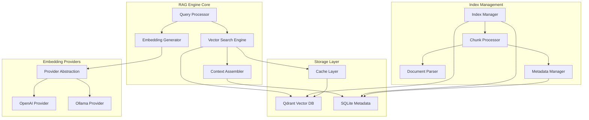
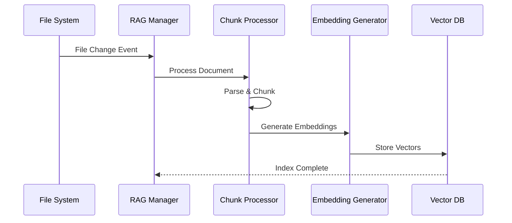
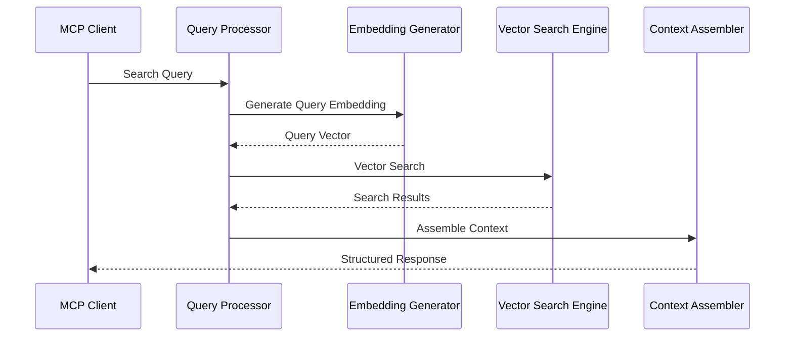

# CQM-TEC-002 RAGエンジン設計

## 1. 概要

### 1.1 目的
CQMシステムの検索・コンテキスト提供の中核となるRAGエンジンの詳細設計を定義し、Phase 0 Ultra-Minimal MVP実装に必要な技術仕様を提供する。

### 1.2 対象範囲
- **埋め込み生成処理**: OpenAI/Ollama対応のマルチプロバイダー設計
- **ベクトル検索**: Qdrant連携による高速・高精度検索
- **インデックス管理**: 作成・更新・削除の完全ライフサイクル
- **チャンク分割**: コード・文書・Issue別の最適化戦略
- **キャッシュシステム**: パフォーマンス要件達成のための階層化キャッシュ

### 1.3 パフォーマンス目標
- **検索応答時間**: < 100ms (Phase 0目標)
- **インデックス更新**: < 500ms (単一ファイル)
- **検索精度**: > 90% (関連度スコア0.7以上)
- **同時処理**: 10 req/sec (複数MCPクライアント)

## 2. RAGエンジン全体アーキテクチャ

### 2.1 コンポーネント構成



### 2.2 処理フロー

#### A. インデックス作成フロー


#### B. 検索実行フロー


## 3. 埋め込み生成処理設計

### 3.1 マルチプロバイダーアーキテクチャ

```typescript
/**
 * 埋め込みプロバイダーの抽象化層
 */
interface IEmbeddingProvider {
  name: string;
  dimensions: number;
  maxTokens: number;
  cost: ProviderCost;
  
  // 基本機能
  generateEmbedding(text: string): Promise<number[]>;
  generateBatchEmbeddings(texts: string[]): Promise<number[][]>;
  
  // プロバイダー管理
  initialize(config: ProviderConfig): Promise<void>;
  isAvailable(): Promise<boolean>;
  getUsageStats(): ProviderUsage;
  
  // 高度機能
  estimateTokens(text: string): number;
  validateInput(text: string): ValidationResult;
}

interface ProviderConfig {
  apiKey?: string;
  baseUrl?: string;
  model: string;
  timeout: number;
  retryConfig: RetryConfig;
}

interface ProviderCost {
  type: 'free' | 'paid' | 'local';
  pricePerToken?: number;
  rateLimit?: RateLimitConfig;
}
```

### 3.2 OpenAI Provider実装

```typescript
class OpenAIEmbeddingProvider implements IEmbeddingProvider {
  name = 'openai';
  dimensions = 1536; // text-embedding-3-small
  maxTokens = 8191;
  cost: ProviderCost = {
    type: 'paid',
    pricePerToken: 0.00002,
    rateLimit: { requestsPerMinute: 3000 }
  };

  private client: OpenAI;
  private rateLimiter: RateLimiter;
  private cache: EmbeddingCache;

  async generateEmbedding(text: string): Promise<number[]> {
    // 入力検証
    const validation = this.validateInput(text);
    if (!validation.isValid) {
      throw new Error(`Invalid input: ${validation.error}`);
    }

    // キャッシュ確認
    const cacheKey = this.generateCacheKey(text);
    const cached = await this.cache.get(cacheKey);
    if (cached) {
      return cached;
    }

    // レート制限確認
    await this.rateLimiter.waitForCapacity();

    try {
      const response = await this.client.embeddings.create({
        model: 'text-embedding-3-small',
        input: text,
        encoding_format: 'float'
      });

      const embedding = response.data[0].embedding;
      
      // キャッシュに保存
      await this.cache.set(cacheKey, embedding, { ttl: 3600 });
      
      // 使用統計更新
      this.updateUsageStats(text.length, response.usage);

      return embedding;

    } catch (error) {
      if (error instanceof OpenAI.APIError) {
        throw new EmbeddingError(
          `OpenAI API error: ${error.message}`,
          'OPENAI_API_ERROR',
          { retryable: error.status >= 500 }
        );
      }
      throw error;
    }
  }

  async generateBatchEmbeddings(texts: string[]): Promise<number[][]> {
    // バッチサイズ制限（OpenAI: 2048個まで）
    const batchSize = 100;
    const results: number[][] = [];

    for (let i = 0; i < texts.length; i += batchSize) {
      const batch = texts.slice(i, i + batchSize);
      
      try {
        const response = await this.client.embeddings.create({
          model: 'text-embedding-3-small',
          input: batch,
          encoding_format: 'float'
        });

        const embeddings = response.data.map(item => item.embedding);
        results.push(...embeddings);

        // バッチ間の待機（レート制限対策）
        if (i + batchSize < texts.length) {
          await this.delay(100);
        }

      } catch (error) {
        // エラー時は個別処理にフォールバック
        for (const text of batch) {
          try {
            const embedding = await this.generateEmbedding(text);
            results.push(embedding);
          } catch (individualError) {
            // 個別エラーは空のベクトルで代替
            results.push(new Array(this.dimensions).fill(0));
          }
        }
      }
    }

    return results;
  }
}
```

### 3.3 Ollama Provider実装

```typescript
class OllamaEmbeddingProvider implements IEmbeddingProvider {
  name = 'ollama';
  dimensions: number; // モデル依存
  maxTokens: number;  // モデル依存
  cost: ProviderCost = {
    type: 'local',
    rateLimit: { requestsPerMinute: 1000 } // ローカル制限
  };

  private client: OllamaClient;
  private modelName: string;
  private modelInfo: OllamaModelInfo;

  constructor(config: OllamaProviderConfig) {
    this.client = new OllamaClient(config.baseUrl);
    this.modelName = config.model || 'nomic-embed-text';
  }

  async initialize(config: ProviderConfig): Promise<void> {
    try {
      // モデル情報取得
      this.modelInfo = await this.client.show(this.modelName);
      this.dimensions = this.extractDimensions(this.modelInfo);
      this.maxTokens = this.extractMaxTokens(this.modelInfo);

      // モデルが利用可能か確認
      if (!await this.isModelAvailable()) {
        throw new Error(`Ollama model not available: ${this.modelName}`);
      }

      // 事前ウォームアップ
      await this.warmupModel();

    } catch (error) {
      throw new EmbeddingError(
        `Failed to initialize Ollama provider: ${error.message}`,
        'OLLAMA_INIT_ERROR'
      );
    }
  }

  async generateEmbedding(text: string): Promise<number[]> {
    const validation = this.validateInput(text);
    if (!validation.isValid) {
      throw new Error(`Invalid input: ${validation.error}`);
    }

    try {
      const response = await this.client.embeddings({
        model: this.modelName,
        prompt: text
      });

      return response.embedding;

    } catch (error) {
      if (error.code === 'ECONNREFUSED') {
        throw new EmbeddingError(
          'Ollama service not available',
          'OLLAMA_CONNECTION_ERROR',
          { retryable: true }
        );
      }
      throw new EmbeddingError(
        `Ollama embedding failed: ${error.message}`,
        'OLLAMA_EMBEDDING_ERROR'
      );
    }
  }

  async isModelAvailable(): Promise<boolean> {
    try {
      const models = await this.client.list();
      return models.models.some(model => model.name === this.modelName);
    } catch {
      return false;
    }
  }

  async ensureModelDownloaded(): Promise<void> {
    if (!await this.isModelAvailable()) {
      await this.client.pull({ model: this.modelName });
    }
  }

  private async warmupModel(): Promise<void> {
    // 小さなテキストで事前実行してモデルをメモリにロード
    try {
      await this.generateEmbedding('warmup');
    } catch {
      // ウォームアップ失敗は無視
    }
  }

  private extractDimensions(modelInfo: OllamaModelInfo): number {
    // モデル名から次元数を推定
    const dimensionMap: Record<string, number> = {
      'nomic-embed-text': 768,
      'mxbai-embed-large': 1024,
      'all-minilm': 384
    };
    return dimensionMap[this.modelName] || 768;
  }
}
```

### 3.4 Provider Selection Strategy

```typescript
class EmbeddingProviderManager {
  private providers: Map<string, IEmbeddingProvider> = new Map();
  private activeProvider: IEmbeddingProvider;
  private fallbackProvider: IEmbeddingProvider;

  async selectOptimalProvider(context: SelectionContext): Promise<IEmbeddingProvider> {
    const criteria = {
      cost: context.costSensitivity,
      latency: context.latencyRequirement,
      quality: context.qualityRequirement,
      availability: await this.checkProviderAvailability()
    };

    // プロバイダー優先順位決定
    if (criteria.cost === 'free' && criteria.availability.ollama) {
      return this.providers.get('ollama')!;
    }

    if (criteria.latency === 'low' && criteria.availability.openai) {
      return this.providers.get('openai')!;
    }

    // フォールバック戦略
    return this.getAvailableProvider() || this.fallbackProvider;
  }

  async handleProviderFailure(failedProvider: string, context: any): Promise<IEmbeddingProvider> {
    // 失敗したプロバイダーを一時的に無効化
    await this.temporarilyDisableProvider(failedProvider, 60000); // 1分間

    // 代替プロバイダーを選択
    const alternatives = this.getAlternativeProviders(failedProvider);
    for (const provider of alternatives) {
      if (await provider.isAvailable()) {
        return provider;
      }
    }

    throw new EmbeddingError('No available embedding provider', 'NO_PROVIDER_AVAILABLE');
  }
}
```

## 4. ベクトル検索エンジン設計

### 4.1 検索アルゴリズム

```typescript
class VectorSearchEngine {
  private qdrantClient: QdrantClient;
  private searchCache: SearchCache;
  private queryOptimizer: QueryOptimizer;

  async search(query: SearchQuery): Promise<SearchResult[]> {
    // クエリ最適化
    const optimizedQuery = await this.queryOptimizer.optimize(query);
    
    // キャッシュ確認
    const cacheKey = this.generateSearchCacheKey(optimizedQuery);
    const cached = await this.searchCache.get(cacheKey);
    if (cached && !this.isCacheStale(cached)) {
      return cached.results;
    }

    // ベクトル検索実行
    const searchResults = await this.executeVectorSearch(optimizedQuery);
    
    // 結果後処理
    const processedResults = await this.postProcessResults(searchResults, optimizedQuery);
    
    // キャッシュ保存
    await this.searchCache.set(cacheKey, {
      results: processedResults,
      timestamp: Date.now(),
      query: optimizedQuery
    });

    return processedResults;
  }

  private async executeVectorSearch(query: OptimizedSearchQuery): Promise<QdrantSearchResult[]> {
    const searchParams: QdrantSearchParams = {
      collection_name: query.collection,
      vector: query.embedding,
      limit: query.limit,
      score_threshold: query.threshold,
      filter: this.buildFilter(query),
      with_payload: true,
      with_vector: false
    };

    // 複数戦略での検索
    const strategies = this.selectSearchStrategies(query);
    const results: QdrantSearchResult[] = [];

    for (const strategy of strategies) {
      const strategyResults = await this.executeSearchStrategy(strategy, searchParams);
      results.push(...strategyResults);
    }

    // 結果統合とデduplication
    return this.mergeAndDeduplicateResults(results);
  }

  private buildFilter(query: OptimizedSearchQuery): QdrantFilter {
    const conditions: QdrantCondition[] = [];

    // カテゴリフィルタ
    if (query.category) {
      conditions.push({
        key: 'category',
        match: { value: query.category }
      });
    }

    // ファイル種別フィルタ
    if (query.fileTypes?.length) {
      conditions.push({
        key: 'file_type',
        match: { any: query.fileTypes }
      });
    }

    // 時間範囲フィルタ
    if (query.timeRange) {
      conditions.push({
        key: 'updated_at',
        range: {
          gte: query.timeRange.start,
          lte: query.timeRange.end
        }
      });
    }

    // 言語フィルタ（コード専用）
    if (query.language) {
      conditions.push({
        key: 'language',
        match: { value: query.language }
      });
    }

    return {
      must: conditions
    };
  }

  private selectSearchStrategies(query: OptimizedSearchQuery): SearchStrategy[] {
    const strategies: SearchStrategy[] = [];

    // デフォルト戦略: コサイン類似度
    strategies.push({
      name: 'cosine_similarity',
      weight: 1.0,
      params: { metric: 'cosine' }
    });

    // 高精度が必要な場合: Euclidean距離も併用
    if (query.qualityRequirement === 'high') {
      strategies.push({
        name: 'euclidean_distance',
        weight: 0.3,
        params: { metric: 'euclidean' }
      });
    }

    // 大量結果が必要な場合: より緩い閾値で追加検索
    if (query.limit > 10) {
      strategies.push({
        name: 'extended_search',
        weight: 0.5,
        params: { 
          threshold: query.threshold * 0.8,
          limit: Math.min(query.limit * 2, 100)
        }
      });
    }

    return strategies;
  }
}
```

### 4.2 検索結果スコアリング

```typescript
class SearchResultScorer {
  private scoringWeights: ScoringWeights = {
    semanticSimilarity: 0.6,
    recency: 0.2,
    fileType: 0.1,
    usage: 0.1
  };

  calculateFinalScore(result: RawSearchResult, query: SearchQuery): number {
    const scores = {
      semantic: this.calculateSemanticScore(result, query),
      recency: this.calculateRecencyScore(result),
      fileType: this.calculateFileTypeScore(result, query),
      usage: this.calculateUsageScore(result)
    };

    return (
      scores.semantic * this.scoringWeights.semanticSimilarity +
      scores.recency * this.scoringWeights.recency +
      scores.fileType * this.scoringWeights.fileType +
      scores.usage * this.scoringWeights.usage
    );
  }

  private calculateSemanticScore(result: RawSearchResult, query: SearchQuery): number {
    // Qdrantからの基本スコア（0-1正規化）
    let score = result.score;

    // クエリ長による調整
    if (query.text.length < 10) {
      score *= 0.9; // 短いクエリは若干減点
    }

    // 完全一致ボーナス
    if (result.content.toLowerCase().includes(query.text.toLowerCase())) {
      score = Math.min(score * 1.1, 1.0);
    }

    return score;
  }

  private calculateRecencyScore(result: RawSearchResult): number {
    const now = Date.now();
    const age = now - result.updatedAt;
    const maxAge = 365 * 24 * 60 * 60 * 1000; // 1年

    // 新しいファイルほど高スコア
    return Math.max(0, 1 - (age / maxAge));
  }

  private calculateFileTypeScore(result: RawSearchResult, query: SearchQuery): number {
    const typeScores: Record<string, number> = {
      'typescript': 1.0,
      'javascript': 0.9,
      'markdown': 0.8,
      'json': 0.7,
      'yaml': 0.6
    };

    const baseScore = typeScores[result.fileType] || 0.5;

    // クエリコンテキストによる調整
    if (query.context === 'code' && ['typescript', 'javascript'].includes(result.fileType)) {
      return Math.min(baseScore * 1.2, 1.0);
    }

    if (query.context === 'documentation' && result.fileType === 'markdown') {
      return Math.min(baseScore * 1.3, 1.0);
    }

    return baseScore;
  }

  private calculateUsageScore(result: RawSearchResult): number {
    // アクセス頻度による調整
    const accessCount = result.metadata.accessCount || 0;
    const maxAccess = 100; // 正規化用

    return Math.min(accessCount / maxAccess, 1.0);
  }
}
```

## 5. インデックス管理設計

### 5.1 インデックスライフサイクル

```typescript
class IndexManager {
  private qdrantClient: QdrantClient;
  private metadataStore: MetadataStore;
  private chunkProcessor: ChunkProcessor;
  private embeddingProvider: IEmbeddingProvider;

  async createIndex(config: IndexConfig): Promise<IndexInfo> {
    const indexId = this.generateIndexId(config);
    
    try {
      // 1. コレクション作成
      await this.createCollection(indexId, config);
      
      // 2. メタデータ初期化
      const metadata = await this.initializeMetadata(indexId, config);
      
      // 3. 初期データ投入
      if (config.initialData) {
        await this.indexInitialData(indexId, config.initialData);
      }

      // 4. インデックス情報登録
      const indexInfo: IndexInfo = {
        id: indexId,
        name: config.name,
        status: 'active',
        config: config,
        metadata: metadata,
        createdAt: new Date(),
        updatedAt: new Date()
      };

      await this.metadataStore.saveIndexInfo(indexInfo);
      
      return indexInfo;

    } catch (error) {
      // エラー時はクリーンアップ
      await this.cleanupFailedIndex(indexId);
      throw new IndexError(`Failed to create index: ${error.message}`, 'INDEX_CREATION_FAILED');
    }
  }

  async updateDocument(indexId: string, document: Document): Promise<void> {
    const startTime = Date.now();
    
    try {
      // 1. ドキュメント解析とチャンク分割
      const chunks = await this.chunkProcessor.processDocument(document);
      
      // 2. 既存チャンクの削除
      await this.deleteDocumentChunks(indexId, document.id);
      
      // 3. 新しいチャンクの埋め込み生成
      const embeddedChunks = await this.generateEmbeddings(chunks);
      
      // 4. ベクトルDB更新
      await this.upsertVectors(indexId, embeddedChunks);
      
      // 5. メタデータ更新
      await this.updateDocumentMetadata(indexId, document);

      // パフォーマンス記録
      const duration = Date.now() - startTime;
      await this.recordPerformanceMetrics(indexId, 'update', duration);

    } catch (error) {
      throw new IndexError(
        `Failed to update document ${document.id}: ${error.message}`,
        'DOCUMENT_UPDATE_FAILED'
      );
    }
  }

  async rebuildIndex(indexId: string, options: RebuildOptions = {}): Promise<void> {
    const indexInfo = await this.metadataStore.getIndexInfo(indexId);
    if (!indexInfo) {
      throw new IndexError(`Index not found: ${indexId}`, 'INDEX_NOT_FOUND');
    }

    // バックアップ作成
    const backupId = await this.createIndexBackup(indexId);
    
    try {
      // 1. インデックス状態をrebuilding に変更
      await this.updateIndexStatus(indexId, 'rebuilding');
      
      // 2. 既存データクリア
      if (!options.incremental) {
        await this.clearIndex(indexId);
      }
      
      // 3. データソース再スキャン
      const documents = await this.scanDataSources(indexInfo.config);
      
      // 4. バッチ処理でインデックス再構築
      await this.batchIndexDocuments(indexId, documents, {
        batchSize: options.batchSize || 100,
        parallelism: options.parallelism || 5,
        progressCallback: options.progressCallback
      });
      
      // 5. インデックス最適化
      await this.optimizeIndex(indexId);
      
      // 6. ステータス更新
      await this.updateIndexStatus(indexId, 'active');
      
      // バックアップ削除
      await this.deleteIndexBackup(backupId);

    } catch (error) {
      // 失敗時はバックアップから復旧
      await this.restoreFromBackup(indexId, backupId);
      throw new IndexError(`Index rebuild failed: ${error.message}`, 'REBUILD_FAILED');
    }
  }

  private async batchIndexDocuments(
    indexId: string,
    documents: Document[],
    options: BatchIndexOptions
  ): Promise<void> {
    const batches = this.createBatches(documents, options.batchSize);
    const semaphore = new Semaphore(options.parallelism);

    const promises = batches.map(async (batch, index) => {
      await semaphore.acquire();
      
      try {
        for (const document of batch) {
          await this.updateDocument(indexId, document);
        }
        
        // 進捗通知
        if (options.progressCallback) {
          const progress = ((index + 1) / batches.length) * 100;
          options.progressCallback(progress);
        }
        
      } finally {
        semaphore.release();
      }
    });

    await Promise.all(promises);
  }
}
```

### 5.2 インクリメンタル更新

```typescript
class IncrementalIndexUpdater {
  private changeDetector: ChangeDetector;
  private conflictResolver: ConflictResolver;

  async performIncrementalUpdate(indexId: string): Promise<UpdateSummary> {
    const startTime = Date.now();
    const summary: UpdateSummary = {
      documentsProcessed: 0,
      documentsAdded: 0,
      documentsUpdated: 0,
      documentsDeleted: 0,
      errors: []
    };

    try {
      // 1. 変更検知
      const changes = await this.changeDetector.detectChanges(indexId);
      
      // 2. 変更処理
      for (const change of changes) {
        try {
          switch (change.type) {
            case 'created':
              await this.handleDocumentCreated(indexId, change.document);
              summary.documentsAdded++;
              break;
              
            case 'modified':
              await this.handleDocumentModified(indexId, change.document, change.previousVersion);
              summary.documentsUpdated++;
              break;
              
            case 'deleted':
              await this.handleDocumentDeleted(indexId, change.documentId);
              summary.documentsDeleted++;
              break;
          }
          
          summary.documentsProcessed++;
          
        } catch (error) {
          summary.errors.push({
            documentId: change.document?.id || change.documentId,
            error: error.message
          });
        }
      }

      // 3. インデックス統計更新
      await this.updateIndexStatistics(indexId, summary);
      
      summary.duration = Date.now() - startTime;
      return summary;

    } catch (error) {
      throw new IndexError(`Incremental update failed: ${error.message}`, 'INCREMENTAL_UPDATE_FAILED');
    }
  }

  private async handleDocumentModified(
    indexId: string,
    document: Document,
    previousVersion?: Document
  ): Promise<void> {
    // コンフリクト検出・解決
    const conflicts = await this.conflictResolver.detectConflicts(document, previousVersion);
    
    if (conflicts.length > 0) {
      const resolution = await this.conflictResolver.resolveConflicts(conflicts);
      document = resolution.resolvedDocument;
    }

    // 効率的な更新（変更チャンクのみ）
    const previousChunks = previousVersion ? 
      await this.chunkProcessor.processDocument(previousVersion) : [];
    const currentChunks = await this.chunkProcessor.processDocument(document);
    
    const chunkDiff = this.calculateChunkDiff(previousChunks, currentChunks);
    
    // 削除が必要なチャンク
    for (const deletedChunk of chunkDiff.deleted) {
      await this.deleteVector(indexId, deletedChunk.id);
    }
    
    // 追加が必要なチャンク
    for (const addedChunk of chunkDiff.added) {
      const embedding = await this.embeddingProvider.generateEmbedding(addedChunk.content);
      await this.upsertVector(indexId, {
        id: addedChunk.id,
        vector: embedding,
        payload: addedChunk.metadata
      });
    }
  }
}
```

## 6. チャンク分割戦略設計

### 6.1 マルチモーダルチャンク処理

```typescript
interface IChunkProcessor {
  processDocument(document: Document): Promise<DocumentChunk[]>;
  getChunkStrategy(document: Document): ChunkStrategy;
}

class MultiModalChunkProcessor implements IChunkProcessor {
  private strategies: Map<string, ChunkStrategy>;

  constructor() {
    this.strategies = new Map([
      ['typescript', new TypeScriptChunkStrategy()],
      ['javascript', new JavaScriptChunkStrategy()],
      ['markdown', new MarkdownChunkStrategy()],
      ['json', new JSONChunkStrategy()],
      ['github_issue', new GitHubIssueChunkStrategy()],
      ['github_pr', new GitHubPRChunkStrategy()]
    ]);
  }

  async processDocument(document: Document): Promise<DocumentChunk[]> {
    const strategy = this.getChunkStrategy(document);
    
    try {
      // 基本チャンク分割
      const rawChunks = await strategy.chunk(document);
      
      // 後処理
      const processedChunks = await this.postProcessChunks(rawChunks, document);
      
      // 品質検証
      const validatedChunks = await this.validateChunks(processedChunks);
      
      return validatedChunks;

    } catch (error) {
      // フォールバック: プレーンテキスト処理
      return await this.fallbackChunking(document);
    }
  }

  getChunkStrategy(document: Document): ChunkStrategy {
    // ファイル種別による戦略選択
    if (document.type === 'github_issue' || document.type === 'github_pr') {
      return this.strategies.get(document.type)!;
    }

    // ファイル拡張子による戦略選択
    const extension = this.extractFileExtension(document.filePath || '');
    const strategy = this.strategies.get(extension);
    
    if (strategy) {
      return strategy;
    }

    // プログラミング言語検出による戦略選択
    const detectedLanguage = this.detectLanguage(document.content);
    return this.strategies.get(detectedLanguage) || this.strategies.get('plain')!;
  }
}
```

### 6.2 TypeScript/JavaScript チャンク戦略

```typescript
class TypeScriptChunkStrategy implements ChunkStrategy {
  private parser: TSParser;
  private astAnalyzer: ASTAnalyzer;

  async chunk(document: Document): Promise<DocumentChunk[]> {
    const chunks: DocumentChunk[] = [];
    
    try {
      // AST解析
      const ast = await this.parser.parse(document.content);
      const symbols = await this.astAnalyzer.extractSymbols(ast);

      // 関数・クラス単位でチャンク分割
      for (const symbol of symbols) {
        const chunk = await this.createSymbolChunk(document, symbol);
        if (chunk && this.isValidChunk(chunk)) {
          chunks.push(chunk);
        }
      }

      // インポート文のチャンク
      const importChunk = await this.createImportChunk(document, ast);
      if (importChunk) {
        chunks.unshift(importChunk); // 先頭に配置
      }

      // 残りのコード（コメント等）
      const remainingChunks = await this.createRemainingChunks(document, symbols);
      chunks.push(...remainingChunks);

    } catch (parseError) {
      // パース失敗時はセマンティック分割にフォールバック
      return await this.fallbackSemanticChunking(document);
    }

    return chunks;
  }

  private async createSymbolChunk(document: Document, symbol: ASTSymbol): Promise<DocumentChunk | null> {
    const content = this.extractSymbolContent(document.content, symbol);
    
    // 最小チャンクサイズチェック
    if (content.length < 50) {
      return null;
    }

    // コンテキスト情報の追加
    const context = await this.generateSymbolContext(document, symbol);
    const enhancedContent = this.enhanceContentWithContext(content, context);

    return {
      id: this.generateChunkId(document.id, symbol.name),
      documentId: document.id,
      content: enhancedContent,
      type: 'code_symbol',
      metadata: {
        symbolName: symbol.name,
        symbolType: symbol.type,
        startLine: symbol.startLine,
        endLine: symbol.endLine,
        filePath: document.filePath,
        language: 'typescript',
        exports: symbol.exports,
        imports: symbol.imports,
        complexity: this.calculateComplexity(symbol),
        ...context
      }
    };
  }

  private async generateSymbolContext(document: Document, symbol: ASTSymbol): Promise<SymbolContext> {
    return {
      // 関数の場合
      parameters: symbol.type === 'function' ? symbol.parameters : undefined,
      returnType: symbol.type === 'function' ? symbol.returnType : undefined,
      
      // クラスの場合  
      methods: symbol.type === 'class' ? symbol.methods : undefined,
      properties: symbol.type === 'class' ? symbol.properties : undefined,
      
      // 共通
      jsdocDescription: symbol.jsdoc?.description,
      usageExamples: await this.findUsageExamples(document, symbol),
      relatedSymbols: await this.findRelatedSymbols(document, symbol)
    };
  }

  private enhanceContentWithContext(content: string, context: SymbolContext): string {
    let enhanced = content;

    // JSDoc説明の追加
    if (context.jsdocDescription) {
      enhanced = `// ${context.jsdocDescription}\n${enhanced}`;
    }

    // 使用例の追加
    if (context.usageExamples?.length) {
      enhanced += '\n\n// Usage examples:\n';
      enhanced += context.usageExamples.map(example => `// ${example}`).join('\n');
    }

    return enhanced;
  }
}
```

### 6.3 Markdown チャンク戦略

```typescript
class MarkdownChunkStrategy implements ChunkStrategy {
  private markdownParser: MarkdownParser;
  private headingExtractor: HeadingExtractor;

  async chunk(document: Document): Promise<DocumentChunk[]> {
    const chunks: DocumentChunk[] = [];
    
    // Markdown解析
    const ast = await this.markdownParser.parse(document.content);
    const sections = await this.headingExtractor.extractSections(ast);

    for (const section of sections) {
      // セクション単位でチャンク作成
      const chunk = await this.createSectionChunk(document, section);
      if (chunk && this.isValidChunk(chunk)) {
        chunks.push(chunk);
      }

      // 大きなセクションはさらに分割
      if (section.content.length > 2000) {
        const subChunks = await this.subdivideSection(document, section);
        chunks.push(...subChunks);
      }
    }

    return chunks;
  }

  private async createSectionChunk(document: Document, section: MarkdownSection): Promise<DocumentChunk> {
    // 階層的コンテキストの構築
    const hierarchicalContext = this.buildHierarchicalContext(section);
    
    // コードブロック抽出
    const codeBlocks = this.extractCodeBlocks(section.content);
    
    // リンク情報抽出
    const links = this.extractLinks(section.content);

    return {
      id: this.generateChunkId(document.id, section.heading.text),
      documentId: document.id,
      content: section.content,
      type: 'documentation_section',
      metadata: {
        heading: section.heading.text,
        headingLevel: section.heading.level,
        hierarchy: hierarchicalContext,
        codeBlocks: codeBlocks,
        links: links,
        filePath: document.filePath,
        section: section.heading.text
      }
    };
  }

  private buildHierarchicalContext(section: MarkdownSection): string[] {
    const context: string[] = [];
    let currentSection = section.parent;
    
    while (currentSection) {
      context.unshift(currentSection.heading.text);
      currentSection = currentSection.parent;
    }
    
    return context;
  }
}
```

### 6.4 GitHub Issue/PR チャンク戦略

```typescript
class GitHubIssueChunkStrategy implements ChunkStrategy {
  async chunk(document: Document): Promise<DocumentChunk[]> {
    const issue = JSON.parse(document.content) as GitHubIssue;
    const chunks: DocumentChunk[] = [];

    // メインIssueチャンク
    const mainChunk: DocumentChunk = {
      id: this.generateChunkId(document.id, 'main'),
      documentId: document.id,
      content: this.formatIssueContent(issue),
      type: 'github_issue',
      metadata: {
        issueNumber: issue.number,
        title: issue.title,
        state: issue.state,
        labels: issue.labels.map(l => l.name),
        assignees: issue.assignees.map(a => a.login),
        author: issue.user.login,
        createdAt: issue.created_at,
        updatedAt: issue.updated_at,
        url: issue.html_url
      }
    };
    chunks.push(mainChunk);

    // コメントチャンク（重要なもののみ）
    for (const comment of issue.comments || []) {
      if (this.isImportantComment(comment)) {
        const commentChunk = this.createCommentChunk(document, issue, comment);
        chunks.push(commentChunk);
      }
    }

    return chunks;
  }

  private formatIssueContent(issue: GitHubIssue): string {
    let content = `# ${issue.title}\n\n`;
    
    // メタ情報
    content += `**Issue #${issue.number}** | `;
    content += `**State**: ${issue.state} | `;
    content += `**Author**: @${issue.user.login}\n\n`;
    
    // ラベル
    if (issue.labels.length > 0) {
      content += `**Labels**: ${issue.labels.map(l => l.name).join(', ')}\n\n`;
    }
    
    // 本文
    content += issue.body || '';
    
    return content;
  }

  private isImportantComment(comment: GitHubComment): boolean {
    // 重要なコメントの判定基準
    return (
      comment.body.length > 100 ||                    // 長いコメント
      comment.body.includes('```') ||                 // コードブロック含む
      comment.user.login === comment.issue_author ||  // 作者のコメント
      comment.body.toLowerCase().includes('solution') // 解決策含む
    );
  }
}
```

## 7. キャッシュ戦略設計

### 7.1 階層化キャッシュアーキテクチャ

```typescript
class HierarchicalCacheManager {
  private l1Cache: MemoryCache;      // L1: インメモリ
  private l2Cache: RedisCache;       // L2: Redis (オプション)
  private l3Cache: DiskCache;        // L3: ディスク永続化

  async get<T>(key: string): Promise<T | null> {
    // L1キャッシュ確認
    let result = await this.l1Cache.get<T>(key);
    if (result !== null) {
      return result;
    }

    // L2キャッシュ確認（利用可能な場合）
    if (this.l2Cache) {
      result = await this.l2Cache.get<T>(key);
      if (result !== null) {
        // L1に昇格
        await this.l1Cache.set(key, result, { ttl: 300 });
        return result;
      }
    }

    // L3キャッシュ確認
    result = await this.l3Cache.get<T>(key);
    if (result !== null) {
      // 上位キャッシュに昇格
      await this.l1Cache.set(key, result, { ttl: 300 });
      if (this.l2Cache) {
        await this.l2Cache.set(key, result, { ttl: 3600 });
      }
    }

    return result;
  }

  async set<T>(key: string, value: T, options: CacheOptions = {}): Promise<void> {
    const ttl = options.ttl || 3600;
    
    // 全レイヤーに保存
    await Promise.all([
      this.l1Cache.set(key, value, { ttl: Math.min(ttl, 300) }),
      this.l2Cache?.set(key, value, { ttl }),
      this.l3Cache.set(key, value, { ttl: ttl * 10 }) // 長期保存
    ].filter(Boolean));
  }
}
```

### 7.2 キャッシュ戦略

```typescript
class CacheStrategyManager {
  // 埋め込みキャッシュ戦略
  async cacheEmbedding(text: string, embedding: number[]): Promise<void> {
    const key = this.generateEmbeddingCacheKey(text);
    const item: CachedEmbedding = {
      embedding,
      textHash: this.hashText(text),
      createdAt: Date.now(),
      accessCount: 1
    };
    
    await this.cacheManager.set(key, item, { ttl: 86400 }); // 24時間
  }

  // 検索結果キャッシュ戦略
  async cacheSearchResults(query: SearchQuery, results: SearchResult[]): Promise<void> {
    const key = this.generateSearchCacheKey(query);
    const item: CachedSearchResult = {
      results,
      query,
      timestamp: Date.now(),
      resultCount: results.length
    };

    // 検索結果は短期キャッシュ
    await this.cacheManager.set(key, item, { ttl: 300 }); // 5分
  }

  // インデックス統計キャッシュ
  async cacheIndexStats(indexId: string, stats: IndexStats): Promise<void> {
    const key = `index_stats:${indexId}`;
    await this.cacheManager.set(key, stats, { ttl: 1800 }); // 30分
  }

  // キャッシュ無効化戦略
  async invalidateRelatedCaches(documentId: string): Promise<void> {
    // 関連する検索結果キャッシュを無効化
    const searchKeys = await this.findRelatedSearchKeys(documentId);
    await Promise.all(searchKeys.map(key => this.cacheManager.delete(key)));

    // インデックス統計キャッシュを無効化
    const indexId = await this.getIndexIdByDocument(documentId);
    await this.cacheManager.delete(`index_stats:${indexId}`);
  }
}
```

## 8. パフォーマンス最適化

### 8.1 バッチ処理最適化

```typescript
class BatchProcessor {
  async processBatchEmbeddings(texts: string[]): Promise<Map<string, number[]>> {
    const batchSize = this.getOptimalBatchSize();
    const batches = this.createBatches(texts, batchSize);
    const results = new Map<string, number[]>();

    // 並列バッチ処理
    const promises = batches.map(async (batch, index) => {
      await this.rateLimiter.waitForSlot();
      
      try {
        const embeddings = await this.embeddingProvider.generateBatchEmbeddings(batch);
        
        batch.forEach((text, i) => {
          results.set(text, embeddings[i]);
        });

      } catch (error) {
        // バッチ失敗時は個別処理にフォールバック
        for (const text of batch) {
          try {
            const embedding = await this.embeddingProvider.generateEmbedding(text);
            results.set(text, embedding);
          } catch (individualError) {
            // 個別エラーはログに記録
            this.logger.warn(`Failed to generate embedding for text: ${individualError.message}`);
          }
        }
      }
    });

    await Promise.all(promises);
    return results;
  }

  private getOptimalBatchSize(): number {
    const providerName = this.embeddingProvider.name;
    
    // プロバイダー別最適バッチサイズ
    const batchSizes: Record<string, number> = {
      'openai': 100,
      'ollama': 50
    };

    return batchSizes[providerName] || 50;
  }
}
```

### 8.2 ベクトル検索最適化

```typescript
class VectorSearchOptimizer {
  async optimizeSearchQuery(query: SearchQuery): Promise<OptimizedSearchQuery> {
    return {
      ...query,
      // クエリ埋め込みの事前計算
      embedding: await this.precomputeQueryEmbedding(query),
      
      // フィルター最適化
      filter: this.optimizeFilter(query.filter),
      
      // 検索パラメータ調整
      params: this.optimizeSearchParams(query)
    };
  }

  private optimizeSearchParams(query: SearchQuery): SearchParams {
    return {
      // 効果的な候補数
      ef: Math.min(query.limit * 4, 200),
      
      // 精度vs速度のバランス
      exact: query.qualityRequirement === 'high',
      
      // 並列検索の活用
      parallel: query.limit > 20
    };
  }
}
```

---

## 付録

### A. パフォーマンステスト仕様

```typescript
interface PerformanceTestSuite {
  // 埋め込み生成性能
  embeddingGeneration: {
    singleText: TestCase<{ text: string }, { duration: number; success: boolean }>;
    batchTexts: TestCase<{ texts: string[]; batchSize: number }, { avgDuration: number; throughput: number }>;
  };
  
  // 検索性能
  vectorSearch: {
    basicSearch: TestCase<{ query: string; indexSize: number }, { duration: number; results: number }>;
    filteredSearch: TestCase<{ query: string; filters: any }, { duration: number; precision: number }>;
    concurrentSearch: TestCase<{ queries: string[]; concurrency: number }, { avgDuration: number; throughput: number }>;
  };
  
  // インデックス性能
  indexManagement: {
    documentUpdate: TestCase<{ documentSize: number; chunksCount: number }, { duration: number }>;
    batchIndex: TestCase<{ documentsCount: number; batchSize: number }, { totalDuration: number; throughput: number }>;
    indexRebuild: TestCase<{ totalDocuments: number }, { duration: number; memoryUsage: number }>;
  };
}
```

### B. 設定例

```yaml
# cqm.yml - RAGエンジン設定
rag:
  embedding:
    provider: "ollama"  # "openai" | "ollama"
    model: "nomic-embed-text"
    config:
      baseUrl: "http://localhost:11434"
      timeout: 30000
      batchSize: 50
      
  vectorDB:
    type: "qdrant"
    config:
      url: "http://localhost:6333"
      collection: "cqm_embeddings"
      vectorSize: 768
      distance: "Cosine"
      
  chunking:
    strategies:
      typescript:
        maxChunkSize: 1000
        overlapSize: 100
        preserveSymbols: true
      markdown:
        splitByHeadings: true
        maxSectionSize: 2000
        preserveCodeBlocks: true
        
  cache:
    enabled: true
    levels:
      memory:
        maxSize: "100MB"
        ttl: 300
      disk:
        path: ".cqm/cache"
        maxSize: "1GB"
        ttl: 86400
```

---

*"Efficient retrieval enables intelligent augmentation - CQM RAG Team"*