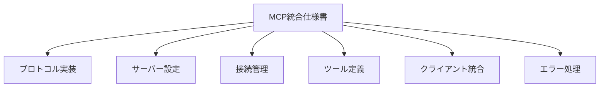
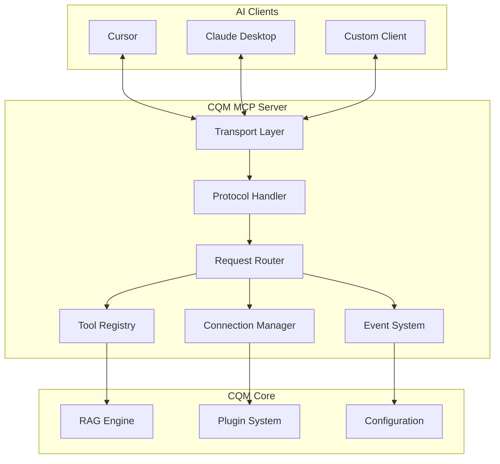
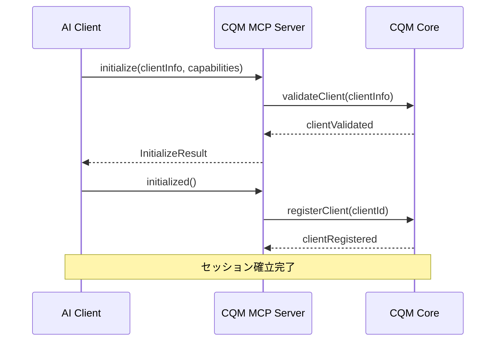
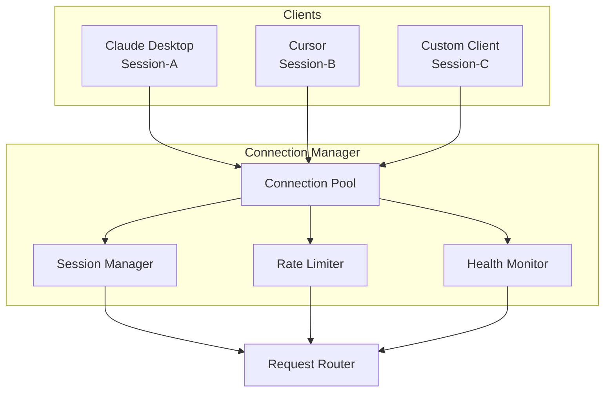

# CQM-MCP-001 MCP統合仕様書

## 1. 概要

### 1.1 文書の目的
本文書は、CQM（Contextual Query Manager）システムにおけるMCP（Model Context Protocol）統合の詳細仕様を定義する。MCPプロトコルを通じてClaude、GPT-4、Gemini等の複数AIモデルに対し、統一されたコンテキスト提供を実現する。

### 1.2 スコープ
- MCPサーバーの実装仕様
- 複数AIクライアントとの同時接続管理
- ツール定義とパラメータ検証
- エラーハンドリングとタイムアウト処理
- Cursor、Claude Desktop等のクライアント統合

### 1.3 文書構成


## 2. MCPプロトコル実装詳細

### 2.1 MCP実装アーキテクチャ



### 2.2 プロトコル仕様

#### 2.2.1 基本プロトコル構造
```typescript
// MCP Protocol Implementation
interface MCPServer {
  // プロトコルバージョン
  readonly protocolVersion: string = "2024-11-05";
  
  // サーバー情報
  readonly serverInfo: ServerInfo;
  
  // サポートされる機能
  readonly capabilities: ServerCapabilities;
  
  // リクエスト処理
  handleRequest(request: MCPRequest): Promise<MCPResponse>;
  
  // イベント送信
  sendNotification(notification: MCPNotification): void;
}

interface ServerInfo {
  name: "CQ Models!";
  version: string;
  description: "Unified context manager for AI models";
  homepage?: "https://github.com/cq-models/cqm";
}

interface ServerCapabilities {
  tools?: {
    listChanged?: boolean;
  };
  resources?: {
    subscribe?: boolean;
    listChanged?: boolean;
  };
  prompts?: {
    listChanged?: boolean;
  };
  logging?: {};
}
```

#### 2.2.2 初期化フロー


#### 2.2.3 リクエスト・レスポンス仕様
```typescript
// 基本リクエスト構造
interface MCPRequest {
  jsonrpc: "2.0";
  id: string | number;
  method: string;
  params?: any;
}

// 基本レスポンス構造
interface MCPResponse {
  jsonrpc: "2.0";
  id: string | number;
  result?: any;
  error?: MCPError;
}

// エラー構造
interface MCPError {
  code: number;
  message: string;
  data?: any;
}

// エラーコード定義
enum MCPErrorCode {
  PARSE_ERROR = -32700,
  INVALID_REQUEST = -32600,
  METHOD_NOT_FOUND = -32601,
  INVALID_PARAMS = -32602,
  INTERNAL_ERROR = -32603,
  // CQM固有エラー
  PLUGIN_ERROR = -32000,
  RAG_ERROR = -32001,
  CONFIG_ERROR = -32002,
  CONNECTION_LIMIT = -32003
}
```

### 2.3 Transport Layer実装

#### 2.3.1 標準入出力（stdio）サポート
```typescript
class StdioTransport implements MCPTransport {
  private readonly stdin = process.stdin;
  private readonly stdout = process.stdout;
  private messageBuffer = "";
  
  constructor() {
    this.stdin.setEncoding('utf8');
    this.stdin.on('data', this.handleInput.bind(this));
  }
  
  private handleInput(chunk: string): void {
    this.messageBuffer += chunk;
    
    let lines = this.messageBuffer.split('\n');
    this.messageBuffer = lines.pop() || "";
    
    for (const line of lines) {
      if (line.trim()) {
        this.processMessage(line);
      }
    }
  }
  
  send(message: any): void {
    const serialized = JSON.stringify(message);
    this.stdout.write(serialized + '\n');
  }
  
  private processMessage(line: string): void {
    try {
      const message = JSON.parse(line);
      this.onMessage?.(message);
    } catch (error) {
      this.onError?.(new Error(`Invalid JSON: ${line}`));
    }
  }
}
```

#### 2.3.2 WebSocket サポート
```typescript
class WebSocketTransport implements MCPTransport {
  private ws?: WebSocket;
  private reconnectAttempts = 0;
  private readonly maxReconnectAttempts = 5;
  private readonly reconnectDelay = 1000;
  
  async connect(url: string): Promise<void> {
    return new Promise((resolve, reject) => {
      this.ws = new WebSocket(url);
      
      this.ws.onopen = () => {
        this.reconnectAttempts = 0;
        resolve();
      };
      
      this.ws.onmessage = (event) => {
        try {
          const message = JSON.parse(event.data);
          this.onMessage?.(message);
        } catch (error) {
          this.onError?.(error);
        }
      };
      
      this.ws.onclose = () => {
        this.handleReconnect();
      };
      
      this.ws.onerror = (error) => {
        reject(error);
      };
    });
  }
  
  send(message: any): void {
    if (this.ws?.readyState === WebSocket.OPEN) {
      this.ws.send(JSON.stringify(message));
    } else {
      throw new Error("WebSocket not connected");
    }
  }
  
  private async handleReconnect(): Promise<void> {
    if (this.reconnectAttempts < this.maxReconnectAttempts) {
      this.reconnectAttempts++;
      await new Promise(resolve => setTimeout(resolve, this.reconnectDelay));
      
      try {
        await this.connect(this.lastUrl);
      } catch (error) {
        console.error(`Reconnection attempt ${this.reconnectAttempts} failed:`, error);
      }
    }
  }
}
```

## 3. サーバー設定仕様

### 3.1 設定ファイル構造
```typescript
interface MCPServerConfig {
  // サーバー基本設定
  server: {
    name: string;
    version: string;
    description: string;
    port?: number;
    host?: string;
  };
  
  // 接続設定
  connection: {
    maxConnections: number;
    timeout: number;
    keepAliveInterval: number;
    heartbeatInterval: number;
  };
  
  // トランスポート設定
  transport: {
    stdio: boolean;
    websocket: boolean;
    tcp: boolean;
  };
  
  // セキュリティ設定
  security: {
    allowedClients: string[];
    rateLimiting: {
      enabled: boolean;
      maxRequestsPerMinute: number;
      maxRequestsPerHour: number;
    };
    authentication: {
      enabled: boolean;
      tokenSecret?: string;
    };
  };
  
  // ログ設定
  logging: {
    level: 'debug' | 'info' | 'warn' | 'error';
    file?: string;
    console: boolean;
    structured: boolean;
  };
  
  // プラグイン設定
  plugins: {
    enabled: string[];
    config: Record<string, any>;
  };
}
```

### 3.2 デフォルト設定
```yaml
# cqm-mcp.yaml
server:
  name: "CQ Models!"
  version: "0.1.0"
  description: "Unified context manager for AI models"
  
connection:
  maxConnections: 10
  timeout: 30000
  keepAliveInterval: 15000
  heartbeatInterval: 5000
  
transport:
  stdio: true
  websocket: false
  tcp: false
  
security:
  allowedClients:
    - "cursor"
    - "claude-desktop"
    - "*"  # 開発時のみ
  rateLimiting:
    enabled: true
    maxRequestsPerMinute: 120
    maxRequestsPerHour: 3600
  authentication:
    enabled: false
    
logging:
  level: "info"
  console: true
  structured: false
  
plugins:
  enabled:
    - "filesystem"
    - "github"
  config:
    filesystem:
      watchPaths: ["./src", "./docs"]
      ignore: ["node_modules", ".git", "*.log"]
    github:
      token: "${GITHUB_TOKEN}"
      owner: "${GITHUB_OWNER}"
      repo: "${GITHUB_REPO}"
```

### 3.3 環境変数サポート
```typescript
class ConfigManager {
  private config: MCPServerConfig;
  
  constructor(configPath?: string) {
    this.config = this.loadConfig(configPath);
    this.resolveEnvironmentVariables();
    this.validateConfig();
  }
  
  private resolveEnvironmentVariables(): void {
    const configStr = JSON.stringify(this.config);
    const resolved = configStr.replace(/\$\{([^}]+)\}/g, (match, varName) => {
      const value = process.env[varName];
      if (!value) {
        throw new Error(`Environment variable ${varName} is not set`);
      }
      return value;
    });
    
    this.config = JSON.parse(resolved);
  }
  
  private validateConfig(): void {
    // 設定値の妥当性検証
    if (this.config.connection.maxConnections < 1) {
      throw new Error("maxConnections must be at least 1");
    }
    
    if (this.config.connection.timeout < 1000) {
      throw new Error("timeout must be at least 1000ms");
    }
    
    // 必須環境変数の確認
    if (this.config.plugins.enabled.includes('github')) {
      if (!process.env.GITHUB_TOKEN) {
        throw new Error("GITHUB_TOKEN is required for github plugin");
      }
    }
  }
}
```

## 4. 接続管理仕様（複数AI同時接続）

### 4.1 接続管理アーキテクチャ


### 4.2 セッション管理
```typescript
interface ClientSession {
  id: string;
  clientInfo: ClientInfo;
  connectedAt: Date;
  lastActivity: Date;
  transport: MCPTransport;
  capabilities: ClientCapabilities;
  context: SessionContext;
}

interface ClientInfo {
  name: string;
  version: string;
  userAgent?: string;
  platform?: string;
}

interface SessionContext {
  currentProject?: string;
  activePlugins: string[];
  preferences: Record<string, any>;
  cache: Map<string, any>;
}

class ConnectionManager {
  private sessions = new Map<string, ClientSession>();
  private readonly maxConnections: number;
  
  constructor(config: MCPServerConfig) {
    this.maxConnections = config.connection.maxConnections;
  }
  
  async addSession(
    transport: MCPTransport,
    clientInfo: ClientInfo
  ): Promise<string> {
    if (this.sessions.size >= this.maxConnections) {
      throw new MCPError(
        MCPErrorCode.CONNECTION_LIMIT,
        "Maximum connections reached"
      );
    }
    
    const sessionId = this.generateSessionId();
    const session: ClientSession = {
      id: sessionId,
      clientInfo,
      connectedAt: new Date(),
      lastActivity: new Date(),
      transport,
      capabilities: {},
      context: {
        activePlugins: [],
        preferences: {},
        cache: new Map()
      }
    };
    
    this.sessions.set(sessionId, session);
    this.startHealthMonitoring(sessionId);
    
    return sessionId;
  }
  
  removeSession(sessionId: string): void {
    const session = this.sessions.get(sessionId);
    if (session) {
      session.transport.disconnect?.();
      this.sessions.delete(sessionId);
    }
  }
  
  getSession(sessionId: string): ClientSession | undefined {
    return this.sessions.get(sessionId);
  }
  
  updateActivity(sessionId: string): void {
    const session = this.sessions.get(sessionId);
    if (session) {
      session.lastActivity = new Date();
    }
  }
  
  private startHealthMonitoring(sessionId: string): void {
    const interval = setInterval(() => {
      const session = this.sessions.get(sessionId);
      if (!session) {
        clearInterval(interval);
        return;
      }
      
      const now = new Date();
      const timeSinceActivity = now.getTime() - session.lastActivity.getTime();
      
      if (timeSinceActivity > 300000) { // 5分
        console.log(`Session ${sessionId} inactive, removing`);
        this.removeSession(sessionId);
        clearInterval(interval);
      }
    }, 60000); // 1分間隔でチェック
  }
  
  private generateSessionId(): string {
    return `cqm-${Date.now()}-${Math.random().toString(36).substr(2, 9)}`;
  }
}
```

### 4.3 レート制限実装
```typescript
class RateLimiter {
  private requests = new Map<string, number[]>();
  private readonly config: RateLimitConfig;
  
  constructor(config: RateLimitConfig) {
    this.config = config;
  }
  
  checkLimit(sessionId: string): boolean {
    if (!this.config.enabled) {
      return true;
    }
    
    const now = Date.now();
    const requests = this.requests.get(sessionId) || [];
    
    // 1時間以内のリクエストをフィルタ
    const recentRequests = requests.filter(
      timestamp => now - timestamp < 3600000
    );
    
    // 1分以内のリクエストをカウント
    const recentMinuteRequests = recentRequests.filter(
      timestamp => now - timestamp < 60000
    );
    
    if (recentMinuteRequests.length >= this.config.maxRequestsPerMinute) {
      return false;
    }
    
    if (recentRequests.length >= this.config.maxRequestsPerHour) {
      return false;
    }
    
    // リクエストを記録
    recentRequests.push(now);
    this.requests.set(sessionId, recentRequests);
    
    return true;
  }
  
  getRemainingQuota(sessionId: string): {
    minute: number;
    hour: number;
  } {
    const now = Date.now();
    const requests = this.requests.get(sessionId) || [];
    
    const recentMinuteRequests = requests.filter(
      timestamp => now - timestamp < 60000
    ).length;
    
    const recentHourRequests = requests.filter(
      timestamp => now - timestamp < 3600000
    ).length;
    
    return {
      minute: Math.max(0, this.config.maxRequestsPerMinute - recentMinuteRequests),
      hour: Math.max(0, this.config.maxRequestsPerHour - recentHourRequests)
    };
  }
}
```

## 5. ツール定義の詳細化

### 5.1 ツール登録システム
```typescript
interface ToolDefinition {
  name: string;
  description: string;
  inputSchema: JSONSchema;
  handler: ToolHandler;
  permissions?: string[];
  rateLimitOverride?: {
    maxCallsPerMinute: number;
  };
}

interface ToolHandler {
  (params: any, context: ToolContext): Promise<ToolResult>;
}

interface ToolContext {
  sessionId: string;
  clientInfo: ClientInfo;
  pluginManager: PluginManager;
  ragEngine: RAGEngine;
}

interface ToolResult {
  content: ToolContent[];
  isError?: boolean;
  metadata?: Record<string, any>;
}

type ToolContent = 
  | { type: "text"; text: string }
  | { type: "resource"; resource: { uri: string; name?: string; description?: string } }
  | { type: "image"; data: string; mimeType: string };

class ToolRegistry {
  private tools = new Map<string, ToolDefinition>();
  
  register(tool: ToolDefinition): void {
    // 入力スキーマの検証
    this.validateInputSchema(tool.inputSchema);
    
    // 既存ツールとの競合チェック
    if (this.tools.has(tool.name)) {
      throw new Error(`Tool ${tool.name} already registered`);
    }
    
    this.tools.set(tool.name, tool);
  }
  
  unregister(name: string): void {
    this.tools.delete(name);
  }
  
  list(): ToolDefinition[] {
    return Array.from(this.tools.values());
  }
  
  get(name: string): ToolDefinition | undefined {
    return this.tools.get(name);
  }
  
  async call(
    name: string,
    params: any,
    context: ToolContext
  ): Promise<ToolResult> {
    const tool = this.tools.get(name);
    if (!tool) {
      throw new MCPError(
        MCPErrorCode.METHOD_NOT_FOUND,
        `Tool ${name} not found`
      );
    }
    
    // パラメータ検証
    this.validateParams(params, tool.inputSchema);
    
    // 権限チェック
    this.checkPermissions(tool, context);
    
    try {
      return await tool.handler(params, context);
    } catch (error) {
      throw new MCPError(
        MCPErrorCode.INTERNAL_ERROR,
        `Tool execution failed: ${error.message}`,
        { tool: name, params }
      );
    }
  }
  
  private validateInputSchema(schema: JSONSchema): void {
    // JSON Schema の妥当性検証
    if (!schema.type || !schema.properties) {
      throw new Error("Invalid input schema");
    }
  }
  
  private validateParams(params: any, schema: JSONSchema): void {
    // Ajv等を使用したパラメータ検証
    const validate = ajv.compile(schema);
    if (!validate(params)) {
      throw new MCPError(
        MCPErrorCode.INVALID_PARAMS,
        "Invalid parameters",
        validate.errors
      );
    }
  }
  
  private checkPermissions(tool: ToolDefinition, context: ToolContext): void {
    if (tool.permissions && tool.permissions.length > 0) {
      // 権限チェックロジック
      // 現在のセッションが必要な権限を持っているかチェック
    }
  }
}
```

### 5.2 コアツール定義

#### 5.2.1 getProjectContext
```typescript
const getProjectContextTool: ToolDefinition = {
  name: "getProjectContext",
  description: "現在のプロジェクトの状況とコンテキストを取得する",
  inputSchema: {
    type: "object",
    properties: {
      includeFiles: {
        type: "boolean",
        description: "ファイル一覧を含めるかどうか",
        default: false
      },
      includeGitStatus: {
        type: "boolean", 
        description: "Git状態を含めるかどうか",
        default: true
      },
      includeIssues: {
        type: "boolean",
        description: "関連するIssueを含めるかどうか",
        default: true
      },
      maxResults: {
        type: "number",
        description: "最大結果数",
        default: 50,
        minimum: 1,
        maximum: 500
      }
    },
    additionalProperties: false
  },
  handler: async (params, context) => {
    const { includeFiles, includeGitStatus, includeIssues, maxResults } = params;
    const result: any = {
      project: {
        name: "CQM",
        description: "Contextual Query Manager",
        version: "0.1.0"
      },
      timestamp: new Date().toISOString()
    };
    
    if (includeGitStatus) {
      result.git = await getGitStatus();
    }
    
    if (includeFiles) {
      result.files = await getProjectFiles(maxResults);
    }
    
    if (includeIssues) {
      result.issues = await getRelatedIssues(maxResults);
    }
    
    return {
      content: [{
        type: "text",
        text: JSON.stringify(result, null, 2)
      }]
    };
  }
};
```

#### 5.2.2 searchDocuments
```typescript
const searchDocumentsTool: ToolDefinition = {
  name: "searchDocuments",
  description: "インデックスされたドキュメントとコードを検索する",
  inputSchema: {
    type: "object",
    properties: {
      query: {
        type: "string",
        description: "検索クエリ",
        minLength: 1,
        maxLength: 1000
      },
      filters: {
        type: "object",
        properties: {
          fileTypes: {
            type: "array",
            items: { type: "string" },
            description: "ファイルタイプフィルタ（例: ['ts', 'md']）"
          },
          modifiedAfter: {
            type: "string",
            format: "date-time",
            description: "指定日時以降に変更されたファイルのみ"
          },
          path: {
            type: "string",
            description: "パスフィルタ（例: 'src/'）"
          }
        },
        additionalProperties: false
      },
      limit: {
        type: "number",
        description: "最大結果数",
        default: 20,
        minimum: 1,
        maximum: 100
      },
      includeContent: {
        type: "boolean",
        description: "マッチした内容を含めるかどうか",
        default: true
      }
    },
    required: ["query"],
    additionalProperties: false
  },
  handler: async (params, context) => {
    const { query, filters, limit, includeContent } = params;
    
    const searchResults = await context.ragEngine.search({
      query,
      filters,
      limit,
      includeContent
    });
    
    const content = searchResults.map(result => ({
      type: "text" as const,
      text: formatSearchResult(result)
    }));
    
    return {
      content,
      metadata: {
        totalResults: searchResults.length,
        searchTime: searchResults.searchTime
      }
    };
  }
};
```

#### 5.2.3 searchIssues
```typescript
const searchIssuesTool: ToolDefinition = {
  name: "searchIssues", 
  description: "GitHub Issueを検索する",
  inputSchema: {
    type: "object",
    properties: {
      query: {
        type: "string",
        description: "検索クエリ",
        minLength: 1
      },
      state: {
        type: "string",
        enum: ["open", "closed", "all"],
        description: "Issue状態",
        default: "open"
      },
      labels: {
        type: "array",
        items: { type: "string" },
        description: "ラベルフィルタ"
      },
      assignee: {
        type: "string",
        description: "アサインされたユーザー"
      },
      limit: {
        type: "number",
        description: "最大結果数",
        default: 10,
        minimum: 1,
        maximum: 50
      }
    },
    required: ["query"],
    additionalProperties: false
  },
  handler: async (params, context) => {
    const githubPlugin = context.pluginManager.getPlugin('github');
    if (!githubPlugin) {
      throw new Error("GitHub plugin not available");
    }
    
    const issues = await githubPlugin.searchIssues(params);
    
    return {
      content: [{
        type: "text",
        text: JSON.stringify(issues, null, 2)
      }]
    };
  }
};
```

#### 5.2.4 createIssue
```typescript
const createIssueTool: ToolDefinition = {
  name: "createIssue",
  description: "新しいGitHub Issueを作成する",
  inputSchema: {
    type: "object",
    properties: {
      title: {
        type: "string",
        description: "Issue タイトル",
        minLength: 1,
        maxLength: 256
      },
      body: {
        type: "string",
        description: "Issue 本文"
      },
      labels: {
        type: "array",
        items: { type: "string" },
        description: "ラベル"
      },
      assignees: {
        type: "array",
        items: { type: "string" },
        description: "アサインするユーザー"
      },
      milestone: {
        type: "string",
        description: "マイルストーン"
      }
    },
    required: ["title"],
    additionalProperties: false
  },
  permissions: ["issues:write"],
  rateLimitOverride: {
    maxCallsPerMinute: 5
  },
  handler: async (params, context) => {
    const githubPlugin = context.pluginManager.getPlugin('github');
    if (!githubPlugin) {
      throw new Error("GitHub plugin not available");
    }
    
    const issue = await githubPlugin.createIssue(params);
    
    return {
      content: [{
        type: "text",
        text: `Issue created: ${issue.html_url}`
      }, {
        type: "resource",
        resource: {
          uri: issue.html_url,
          name: issue.title,
          description: "Created GitHub Issue"
        }
      }]
    };
  }
};
```

#### 5.2.5 findSimilarCode
```typescript
const findSimilarCodeTool: ToolDefinition = {
  name: "findSimilarCode",
  description: "類似のコードパターンを検索する",
  inputSchema: {
    type: "object",
    properties: {
      code: {
        type: "string",
        description: "検索対象のコード",
        minLength: 10
      },
      language: {
        type: "string",
        description: "プログラミング言語",
        enum: ["typescript", "javascript", "python", "go", "rust", "java"]
      },
      similarity: {
        type: "number",
        description: "類似度閾値 (0.0-1.0)",
        minimum: 0.0,
        maximum: 1.0,
        default: 0.7
      },
      limit: {
        type: "number",
        description: "最大結果数",
        default: 10,
        minimum: 1,
        maximum: 50
      }
    },
    required: ["code"],
    additionalProperties: false
  },
  handler: async (params, context) => {
    const { code, language, similarity, limit } = params;
    
    const similarCode = await context.ragEngine.findSimilarCode({
      code,
      language,
      similarity,
      limit
    });
    
    return {
      content: similarCode.map(result => ({
        type: "text" as const,
        text: `File: ${result.file}\nSimilarity: ${result.similarity}\n\n${result.code}`
      }))
    };
  }
};
```

## 6. エラーハンドリングとタイムアウト処理

### 6.1 エラー分類とハンドリング
```typescript
enum ErrorSeverity {
  LOW = "low",
  MEDIUM = "medium", 
  HIGH = "high",
  CRITICAL = "critical"
}

interface ErrorContext {
  sessionId: string;
  toolName?: string;
  timestamp: Date;
  requestId: string;
  clientInfo: ClientInfo;
}

class ErrorHandler {
  private errorLog: ErrorLog[] = [];
  
  handleError(error: Error, context: ErrorContext): MCPError {
    const severity = this.classifyError(error);
    
    // エラーログ記録
    this.logError(error, context, severity);
    
    // アラート送信（重要度高の場合）
    if (severity === ErrorSeverity.HIGH || severity === ErrorSeverity.CRITICAL) {
      this.sendAlert(error, context, severity);
    }
    
    // リトライ可能性判定
    const retryable = this.isRetryable(error);
    
    // ユーザーフレンドリーなエラーメッセージ生成
    const userMessage = this.generateUserMessage(error, severity);
    
    return {
      code: this.mapToMCPError(error),
      message: userMessage,
      data: {
        severity,
        retryable,
        requestId: context.requestId,
        timestamp: context.timestamp.toISOString()
      }
    };
  }
  
  private classifyError(error: Error): ErrorSeverity {
    // プラグインエラー
    if (error.name === "PluginError") {
      return ErrorSeverity.MEDIUM;
    }
    
    // RAGエンジンエラー
    if (error.name === "RAGError") {
      return ErrorSeverity.HIGH;
    }
    
    // ネットワークエラー
    if (error.message.includes("network") || error.message.includes("timeout")) {
      return ErrorSeverity.MEDIUM;
    }
    
    // 設定エラー
    if (error.name === "ConfigError") {
      return ErrorSeverity.HIGH;
    }
    
    // その他の内部エラー
    return ErrorSeverity.LOW;
  }
  
  private isRetryable(error: Error): boolean {
    const retryableErrors = [
      "TimeoutError",
      "NetworkError", 
      "TemporaryError",
      "RateLimitError"
    ];
    
    return retryableErrors.some(type => 
      error.name === type || error.message.includes(type)
    );
  }
  
  private generateUserMessage(error: Error, severity: ErrorSeverity): string {
    switch (severity) {
      case ErrorSeverity.LOW:
        return "処理中に軽微なエラーが発生しました。しばらく待ってから再試行してください。";
      
      case ErrorSeverity.MEDIUM:
        return "一時的なエラーが発生しました。接続状態を確認して再試行してください。";
      
      case ErrorSeverity.HIGH:
        return "システムエラーが発生しました。管理者にお問い合わせください。";
      
      case ErrorSeverity.CRITICAL:
        return "重大なシステムエラーが発生しました。システム管理者に緊急で連絡してください。";
      
      default:
        return "不明なエラーが発生しました。";
    }
  }
  
  private mapToMCPError(error: Error): number {
    switch (error.name) {
      case "ValidationError":
        return MCPErrorCode.INVALID_PARAMS;
      case "TimeoutError":
        return MCPErrorCode.INTERNAL_ERROR;
      case "PluginError":
        return MCPErrorCode.PLUGIN_ERROR;
      case "RAGError":
        return MCPErrorCode.RAG_ERROR;
      case "ConfigError":
        return MCPErrorCode.CONFIG_ERROR;
      default:
        return MCPErrorCode.INTERNAL_ERROR;
    }
  }
}
```

### 6.2 タイムアウト処理
```typescript
class TimeoutManager {
  private readonly defaultTimeout = 30000; // 30秒
  private activeRequests = new Map<string, NodeJS.Timeout>();
  
  withTimeout<T>(
    promise: Promise<T>,
    timeout?: number,
    requestId?: string
  ): Promise<T> {
    const timeoutMs = timeout || this.defaultTimeout;
    const id = requestId || this.generateRequestId();
    
    return new Promise((resolve, reject) => {
      // タイムアウト設定
      const timeoutHandle = setTimeout(() => {
        this.activeRequests.delete(id);
        reject(new TimeoutError(`Request timeout after ${timeoutMs}ms`));
      }, timeoutMs);
      
      this.activeRequests.set(id, timeoutHandle);
      
      // 元のPromiseの処理
      promise
        .then(result => {
          clearTimeout(timeoutHandle);
          this.activeRequests.delete(id);
          resolve(result);
        })
        .catch(error => {
          clearTimeout(timeoutHandle);
          this.activeRequests.delete(id);
          reject(error);
        });
    });
  }
  
  cancelRequest(requestId: string): boolean {
    const timeoutHandle = this.activeRequests.get(requestId);
    if (timeoutHandle) {
      clearTimeout(timeoutHandle);
      this.activeRequests.delete(requestId);
      return true;
    }
    return false;
  }
  
  getActiveRequestCount(): number {
    return this.activeRequests.size;
  }
  
  private generateRequestId(): string {
    return `req-${Date.now()}-${Math.random().toString(36).substr(2, 9)}`;
  }
}

class TimeoutError extends Error {
  constructor(message: string) {
    super(message);
    this.name = "TimeoutError";
  }
}
```

### 6.3 サーキットブレーカー実装
```typescript
enum CircuitState {
  CLOSED = "closed",
  OPEN = "open", 
  HALF_OPEN = "half_open"
}

class CircuitBreaker {
  private state = CircuitState.CLOSED;
  private failureCount = 0;
  private lastFailureTime?: Date;
  private nextAttemptTime?: Date;
  
  constructor(
    private readonly failureThreshold = 5,
    private readonly recoveryTimeout = 60000,
    private readonly monitorWindow = 300000
  ) {}
  
  async execute<T>(fn: () => Promise<T>): Promise<T> {
    if (this.state === CircuitState.OPEN) {
      if (this.shouldAttemptReset()) {
        this.state = CircuitState.HALF_OPEN;
      } else {
        throw new Error("Circuit breaker is OPEN");
      }
    }
    
    try {
      const result = await fn();
      this.onSuccess();
      return result;
    } catch (error) {
      this.onFailure();
      throw error;
    }
  }
  
  private onSuccess(): void {
    this.failureCount = 0;
    this.state = CircuitState.CLOSED;
    this.nextAttemptTime = undefined;
  }
  
  private onFailure(): void {
    this.failureCount++;
    this.lastFailureTime = new Date();
    
    if (this.failureCount >= this.failureThreshold) {
      this.state = CircuitState.OPEN;
      this.nextAttemptTime = new Date(Date.now() + this.recoveryTimeout);
    }
  }
  
  private shouldAttemptReset(): boolean {
    return this.nextAttemptTime !== undefined && 
           new Date() >= this.nextAttemptTime;
  }
  
  getState(): {
    state: CircuitState;
    failureCount: number;
    lastFailureTime?: Date;
    nextAttemptTime?: Date;
  } {
    return {
      state: this.state,
      failureCount: this.failureCount,
      lastFailureTime: this.lastFailureTime,
      nextAttemptTime: this.nextAttemptTime
    };
  }
}
```

## 7. Cursor/Claude Desktop統合の具体的手順

### 7.1 Cursor統合設定

#### 7.1.1 設定ファイル
```json
// Cursor設定（settings.json）
{
  "mcp.servers": {
    "cqm": {
      "command": "node",
      "args": ["/path/to/cqm/dist/mcp-server.js"],
      "env": {
        "CQM_CONFIG_PATH": "/path/to/cqm.yaml",
        "CQM_LOG_LEVEL": "info"
      }
    }
  },
  
  "mcp.serverSettings": {
    "cqm": {
      "timeout": 30000,
      "retryAttempts": 3,
      "retryDelay": 1000
    }
  }
}
```

#### 7.1.2 プロジェクト固有設定
```json
// .cursor/settings.json (プロジェクトルート)
{
  "mcp.servers": {
    "cqm-project": {
      "command": "cqm",
      "args": ["mcp-server", "--project", "."],
      "cwd": "${workspaceFolder}",
      "env": {
        "CQM_PROJECT_ROOT": "${workspaceFolder}",
        "GITHUB_TOKEN": "${env:GITHUB_TOKEN}"
      }
    }
  }
}
```

### 7.2 Claude Desktop統合設定

#### 7.2.1 設定ファイル
```json
// Claude Desktop設定（claude_desktop_config.json）
{
  "mcpServers": {
    "cqm": {
      "command": "cqm",
      "args": ["mcp-server"],
      "env": {
        "CQM_CONFIG_PATH": "~/.config/cqm/config.yaml"
      }
    }
  },
  
  "serverSettings": {
    "cqm": {
      "autoStart": true,
      "restartOnFailure": true,
      "maxRestarts": 3
    }
  }
}
```

#### 7.2.2 インストールスクリプト
```bash
#!/bin/bash
# install-claude-desktop.sh

set -e

echo "Installing CQM for Claude Desktop..."

# 設定ディレクトリ作成
mkdir -p ~/.config/claude-desktop

# 設定ファイル作成
cat > ~/.config/claude-desktop/claude_desktop_config.json << 'EOF'
{
  "mcpServers": {
    "cqm": {
      "command": "cqm",
      "args": ["mcp-server", "--stdio"],
      "env": {
        "CQM_CONFIG_PATH": "$HOME/.config/cqm/config.yaml",
        "CQM_LOG_LEVEL": "info"
      }
    }
  }
}
EOF

echo "Configuration created at ~/.config/claude-desktop/claude_desktop_config.json"
echo "Please restart Claude Desktop to apply changes."
```

### 7.3 自動検出機能
```typescript
class ClientDetector {
  static detectClientType(clientInfo: ClientInfo): string {
    const name = clientInfo.name.toLowerCase();
    const userAgent = clientInfo.userAgent?.toLowerCase() || "";
    
    if (name.includes("cursor") || userAgent.includes("cursor")) {
      return "cursor";
    }
    
    if (name.includes("claude") && name.includes("desktop")) {
      return "claude-desktop";
    }
    
    if (userAgent.includes("vscode")) {
      return "vscode";
    }
    
    return "unknown";
  }
  
  static getClientCapabilities(clientType: string): ClientCapabilities {
    switch (clientType) {
      case "cursor":
        return {
          supports: {
            resources: true,
            tools: true,
            prompts: true,
            rootsListing: true
          },
          experimental: {
            progressNotifications: true,
            sampling: false
          }
        };
        
      case "claude-desktop":
        return {
          supports: {
            resources: true,
            tools: true,
            prompts: false,
            rootsListing: false
          },
          experimental: {
            progressNotifications: false,
            sampling: true
          }
        };
        
      default:
        return {
          supports: {
            resources: true,
            tools: true,
            prompts: false,
            rootsListing: false
          }
        };
    }
  }
}
```

### 7.4 デバッグとトラブルシューティング

#### 7.4.1 ログ設定
```typescript
class MCPLogger {
  private logger: Logger;
  
  constructor(config: LogConfig) {
    this.logger = winston.createLogger({
      level: config.level,
      format: winston.format.combine(
        winston.format.timestamp(),
        winston.format.errors({ stack: true }),
        winston.format.json()
      ),
      transports: [
        new winston.transports.Console({
          format: winston.format.simple()
        }),
        new winston.transports.File({
          filename: config.file || 'cqm-mcp.log',
          maxsize: 10485760, // 10MB
          maxFiles: 5
        })
      ]
    });
  }
  
  logRequest(sessionId: string, method: string, params: any): void {
    this.logger.info("MCP Request", {
      sessionId,
      method,
      params: this.sanitizeParams(params),
      timestamp: new Date().toISOString()
    });
  }
  
  logResponse(sessionId: string, method: string, duration: number, error?: Error): void {
    if (error) {
      this.logger.error("MCP Response Error", {
        sessionId,
        method,
        duration,
        error: error.message,
        stack: error.stack
      });
    } else {
      this.logger.info("MCP Response Success", {
        sessionId,
        method,
        duration
      });
    }
  }
  
  private sanitizeParams(params: any): any {
    // センシティブな情報を除去
    const sanitized = { ...params };
    const sensitiveKeys = ['token', 'password', 'secret', 'key'];
    
    for (const key of sensitiveKeys) {
      if (key in sanitized) {
        sanitized[key] = '[REDACTED]';
      }
    }
    
    return sanitized;
  }
}
```

#### 7.4.2 ヘルスチェック機能
```typescript
class HealthChecker {
  async checkHealth(): Promise<HealthStatus> {
    const checks = await Promise.allSettled([
      this.checkMCPServer(),
      this.checkRAGEngine(),
      this.checkPlugins(),
      this.checkConnections()
    ]);
    
    const results = checks.map((check, index) => ({
      name: ['mcp-server', 'rag-engine', 'plugins', 'connections'][index],
      status: check.status === 'fulfilled' ? 'healthy' : 'unhealthy',
      details: check.status === 'fulfilled' ? check.value : check.reason.message
    }));
    
    const overallStatus = results.every(r => r.status === 'healthy') ? 'healthy' : 'unhealthy';
    
    return {
      status: overallStatus,
      timestamp: new Date().toISOString(),
      checks: results
    };
  }
  
  private async checkMCPServer(): Promise<string> {
    // MCPサーバーの基本機能チェック
    return "MCP server is responding";
  }
  
  private async checkRAGEngine(): Promise<string> {
    // RAGエンジンの接続チェック
    return "RAG engine is operational";
  }
  
  private async checkPlugins(): Promise<string> {
    // プラグインの状態チェック
    return "All plugins loaded successfully";
  }
  
  private async checkConnections(): Promise<string> {
    // アクティブ接続の状態チェック
    return "All connections are healthy";
  }
}
```

## 8. パフォーマンス最適化

### 8.1 接続プール最適化
```typescript
class OptimizedConnectionManager extends ConnectionManager {
  private connectionPool: ConnectionPool;
  private metricsCollector: MetricsCollector;
  
  constructor(config: MCPServerConfig) {
    super(config);
    this.connectionPool = new ConnectionPool(config.connection);
    this.metricsCollector = new MetricsCollector();
  }
  
  async handleRequest(sessionId: string, request: MCPRequest): Promise<MCPResponse> {
    const startTime = Date.now();
    
    try {
      // リクエスト前処理
      await this.preprocessRequest(sessionId, request);
      
      // メイン処理
      const response = await super.handleRequest(sessionId, request);
      
      // メトリクス記録
      this.metricsCollector.recordRequest(
        request.method,
        Date.now() - startTime,
        'success'
      );
      
      return response;
    } catch (error) {
      this.metricsCollector.recordRequest(
        request.method,
        Date.now() - startTime,
        'error'
      );
      throw error;
    }
  }
  
  private async preprocessRequest(sessionId: string, request: MCPRequest): Promise<void> {
    // リクエストの前処理（キャッシュチェック等）
    if (this.isCacheable(request)) {
      const cached = await this.getCachedResponse(request);
      if (cached) {
        throw new CachedResponseError(cached);
      }
    }
  }
}
```

### 8.2 レスポンスキャッシュ
```typescript
class ResponseCache {
  private cache = new Map<string, CacheEntry>();
  private readonly maxSize = 1000;
  private readonly ttl = 300000; // 5分
  
  set(key: string, value: any, customTtl?: number): void {
    if (this.cache.size >= this.maxSize) {
      this.evictOldest();
    }
    
    this.cache.set(key, {
      value,
      timestamp: Date.now(),
      ttl: customTtl || this.ttl
    });
  }
  
  get(key: string): any | undefined {
    const entry = this.cache.get(key);
    if (!entry) {
      return undefined;
    }
    
    if (Date.now() - entry.timestamp > entry.ttl) {
      this.cache.delete(key);
      return undefined;
    }
    
    return entry.value;
  }
  
  private evictOldest(): void {
    const oldestKey = this.cache.keys().next().value;
    if (oldestKey) {
      this.cache.delete(oldestKey);
    }
  }
}
```

## 9. 運用と監視

### 9.1 メトリクス収集
```typescript
interface MCPMetrics {
  connections: {
    active: number;
    total: number;
    byClient: Record<string, number>;
  };
  requests: {
    total: number;
    successful: number;
    failed: number;
    avgResponseTime: number;
    byMethod: Record<string, RequestMetrics>;
  };
  resources: {
    memoryUsage: number;
    cpuUsage: number;
  };
}

class MetricsCollector {
  private metrics: MCPMetrics = {
    connections: { active: 0, total: 0, byClient: {} },
    requests: { total: 0, successful: 0, failed: 0, avgResponseTime: 0, byMethod: {} },
    resources: { memoryUsage: 0, cpuUsage: 0 }
  };
  
  recordRequest(method: string, duration: number, status: 'success' | 'error'): void {
    this.metrics.requests.total++;
    
    if (status === 'success') {
      this.metrics.requests.successful++;
    } else {
      this.metrics.requests.failed++;
    }
    
    // 平均レスポンス時間の更新
    this.updateAverageResponseTime(duration);
    
    // メソッド別メトリクス
    if (!this.metrics.requests.byMethod[method]) {
      this.metrics.requests.byMethod[method] = {
        total: 0,
        successful: 0,
        failed: 0,
        avgDuration: 0
      };
    }
    
    const methodMetrics = this.metrics.requests.byMethod[method];
    methodMetrics.total++;
    
    if (status === 'success') {
      methodMetrics.successful++;
    } else {
      methodMetrics.failed++;
    }
    
    // メソッド別平均時間の更新
    methodMetrics.avgDuration = 
      (methodMetrics.avgDuration * (methodMetrics.total - 1) + duration) / methodMetrics.total;
  }
  
  getMetrics(): MCPMetrics {
    this.updateResourceMetrics();
    return { ...this.metrics };
  }
  
  private updateResourceMetrics(): void {
    const memUsage = process.memoryUsage();
    this.metrics.resources.memoryUsage = memUsage.heapUsed;
    
    // CPU使用率の計算（簡易版）
    this.metrics.resources.cpuUsage = process.cpuUsage().user / 1000000;
  }
}
```

### 9.2 アラート設定
```typescript
class AlertManager {
  private rules: AlertRule[] = [];
  
  addRule(rule: AlertRule): void {
    this.rules.push(rule);
  }
  
  checkAlerts(metrics: MCPMetrics): void {
    for (const rule of this.rules) {
      if (rule.condition(metrics)) {
        this.sendAlert(rule, metrics);
      }
    }
  }
  
  private sendAlert(rule: AlertRule, metrics: MCPMetrics): void {
    const alert: Alert = {
      id: `alert-${Date.now()}`,
      rule: rule.name,
      severity: rule.severity,
      message: rule.message,
      timestamp: new Date(),
      metrics
    };
    
    // アラート送信ロジック（例：Discord、Slack等）
    this.dispatchAlert(alert);
  }
}

// アラートルール例
const defaultAlertRules: AlertRule[] = [
  {
    name: "High Error Rate",
    condition: (metrics) => {
      const errorRate = metrics.requests.failed / metrics.requests.total;
      return errorRate > 0.1; // 10%以上のエラー率
    },
    severity: "high",
    message: "Error rate exceeded 10%"
  },
  {
    name: "High Response Time",
    condition: (metrics) => metrics.requests.avgResponseTime > 5000,
    severity: "medium", 
    message: "Average response time exceeded 5 seconds"
  },
  {
    name: "Memory Usage",
    condition: (metrics) => metrics.resources.memoryUsage > 1024 * 1024 * 1024, // 1GB
    severity: "medium",
    message: "Memory usage exceeded 1GB"
  }
];
```

## 10. まとめ

### 10.1 実装優先度

**Phase 1 (Week 1-2)**:
1. 基本MCPサーバー実装
2. stdio transport実装  
3. 基本ツール（getProjectContext、searchDocuments）実装
4. Cursor統合

**Phase 2 (Week 3-4)**:
1. 接続管理システム実装
2. エラーハンドリング強化
3. Claude Desktop統合
4. パフォーマンス最適化

**Phase 3 (Week 5-6)**:
1. 監視・メトリクス機能
2. アラートシステム
3. セキュリティ強化
4. ドキュメント整備

### 10.2 成功指標
- [ ] Cursor/Claude Desktopからの安定接続
- [ ] 複数クライアントの同時接続（最大10接続）
- [ ] 平均レスポンス時間 < 2秒
- [ ] エラー率 < 5%
- [ ] 24時間連続稼働
- [ ] プラグインシステムとの完全統合

### 10.3 注意事項
- MCPプロトコルの仕様変更に対する追従が必要
- クライアント固有の実装差異への対応
- セキュリティとパフォーマンスのバランス
- エラーメッセージの日本語化対応

---

## 変更履歴

| バージョン | 日付 | 変更内容 | 作成者 |
|-----------|------|----------|--------|
| v1.0 | 2025-08-02 | 初版作成 | Claude Code |