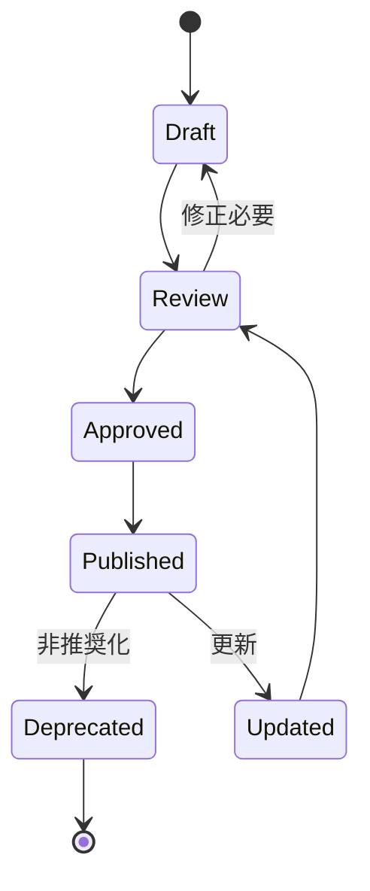

# CQM-POL-001 文書管理ガイドライン

## 1. 文書管理方針

### 1.1 基本原則
- **実装可能性優先**: 実装者が迷わない明確な仕様
- **段階的詳細化**: MVP → 機能拡張の順序で文書を整備
- **継続的更新**: 実装と並行した文書の改善
- **多言語対応**: ユーザー向け（日本語）、開発者向け（英語）の併記

### 1.2 品質基準
- **完全性**: 実装に必要な情報がすべて含まれている
- **一貫性**: 用語、形式、構造の統一
- **追跡可能性**: 要件から実装まで一貫した参照関係
- **検索可能性**: RAGシステムでの効率的な検索を考慮

### 1.3 更新管理
- **バージョン管理**: セマンティックバージョニングに準拠
- **変更記録**: 各文書の変更履歴を明記
- **承認プロセス**: 重要な変更は複数人でのレビュー
- **通知システム**: 関連者への変更通知

## 2. 文書分類と管理

### 2.1 文書タイプ

#### A. 要件・仕様書（Requirements）
- **目的**: プロダクトの何を作るかを定義
- **対象読者**: ステークホルダー全体
- **更新頻度**: 高（初期）→ 低（安定期）
- **形式**: Markdown + Mermaid図

#### B. 設計書（Design）
- **目的**: どのように実装するかを定義
- **対象読者**: 開発者、アーキテクト
- **更新頻度**: 中（実装に応じて）
- **形式**: Markdown + TypeScript interfaces

#### C. 運用書（Operations）
- **目的**: システムの構築・運用方法を定義
- **対象読者**: 運用者、ユーザー
- **更新頻度**: 中（機能追加に応じて）
- **形式**: Markdown + YAML設定例

#### D. 開発ガイド（Development）
- **目的**: 開発プロセスとルールを定義
- **対象読者**: 開発者、コントリビューター
- **更新頻度**: 低（ルール変更時のみ）
- **形式**: Markdown + コード例

### 2.2 文書ライフサイクル



### 2.3 品質チェック項目

#### 要件・仕様書
- [ ] ユースケースが明確に定義されている
- [ ] 非機能要件が具体的な数値で記載されている
- [ ] 制約・前提条件が明記されている
- [ ] 成功指標が測定可能である

#### 設計書
- [ ] アーキテクチャ図が最新の実装と一致している
- [ ] インターフェース仕様が完全である
- [ ] データモデルが実装可能な粒度で定義されている
- [ ] エラーハンドリング方針が明確である

#### 運用書
- [ ] セットアップ手順が検証済みである
- [ ] 設定例が動作確認済みである
- [ ] トラブルシューティングが実例ベースである
- [ ] セキュリティ考慮事項が含まれている

## 3. フォルダ構成とファイル命名

### 3.1 docsフォルダ構成（zing準拠）

```
docs/                                    # Obsidian Vault対応
├── .obsidian/                          # Obsidian設定
│   ├── app.json                        # 基本設定
│   ├── appearance.json                 # 外観設定
│   ├── core-plugins.json               # コアプラグイン設定
│   └── templates/                      # テンプレート格納
│       ├── requirement-template.md
│       ├── technical-template.md
│       ├── mcp-template.md
│       └── adr-template.md
├── 00_Overview/                        # プロジェクト概要
│   ├── README.md                       # Vault説明書
│   └── CQM-POL-001_文書管理ガイドライン.md
├── 01_Requirements/                    # 要件定義
│   ├── CQM-REQ-001-v1.1_要件定義書.md
│   ├── CQM-REQ-002_ユースケース仕様書.md
│   ├── CQM-REQ-003_非機能要件書.md
│   └── CQM-REQ-004_用語集.md
├── 02_Architecture/                    # システム設計
│   ├── CQM-ARC-001_システムアーキテクチャ.md
│   ├── CQM-ARC-002_データモデル設計.md
│   ├── CQM-ARC-003_プラグインアーキテクチャ.md
│   └── CQM-ARC-004_セキュリティ設計.md
├── 03_Technical/                       # 技術設計
│   ├── CQM-TEC-001_コアモジュール設計.md
│   ├── CQM-TEC-002_RAGエンジン設計.md
│   ├── CQM-TEC-003_CLI設計.md
│   ├── CQM-TEC-004_プラグインAPI設計.md
│   └── CQM-TEC-005_データベース設計.md
├── 04_MCP/                             # MCP仕様
│   ├── CQM-MCP-001_MCP統合仕様書.md
│   ├── CQM-MCP-002_アダプター設計.md
│   └── CQM-MCP-003_ツール定義.md
├── 05_Implementation/                  # 実装ガイド
│   ├── CQM-IMP-001_セットアップガイド.md
│   ├── CQM-IMP-002_設定ガイド.md
│   ├── CQM-IMP-003_デプロイメントガイド.md
│   └── CQM-IMP-004_トラブルシューティング.md
├── 06_Development/                     # 開発ガイド
│   ├── CQM-DEV-001_コーディング規約.md
│   ├── CQM-DEV-002_テスト戦略.md
│   ├── CQM-DEV-003_プラグイン開発ガイド.md
│   └── CQM-DEV-004_コントリビューションガイド.md
├── 07_Examples/                        # 使用例・チュートリアル
│   ├── CQM-EXM-001_Getting_Started.md
│   ├── CQM-EXM-002_設定例集.md
│   └── CQM-EXM-003_プラグイン作成例.md
├── 08_Reference/                       # リファレンス
│   ├── CQM-REF-001_CLIリファレンス.md
│   ├── CQM-REF-002_APIリファレンス.md
│   └── CQM-REF-003_プラグインAPIリファレンス.md
├── 09_Tasks/                           # タスク管理
│   ├── CQM-TSK-001_Phase0タスクリスト.md
│   ├── CQM-TSK-002_Phase1タスクリスト.md
│   └── active/                         # 進行中タスク
├── 10_Decisions/                       # アーキテクチャ決定記録
│   ├── CQM-ADR-001_技術スタック選定.md
│   ├── CQM-ADR-002_MCPプロトコル採用.md
│   ├── CQM-ADR-003_プラグインアーキテクチャ.md
│   └── template-adr.md
├── 11_Testing/                         # テスト関連
│   ├── CQM-TST-001_テスト戦略.md
│   ├── CQM-TST-002_品質保証計画.md
│   └── CQM-TST-003_パフォーマンステスト.md
├── 12_Policies/                        # ポリシー
│   ├── CQM-POL-001_文書管理ガイドライン.md
│   ├── CQM-POL-002_セキュリティポリシー.md
│   └── CQM-POL-003_データプライバシーポリシー.md
├── 90_Meeting_Notes/                   # 議事録
└── 99_Archive/                         # アーカイブ
```

### 3.2 文書番号体系（zing準拠）

#### 基本フォーマット
```
[プロジェクト]-[カテゴリ]-[連番]-[バージョン]_[タイトル].md
例: CQM-REQ-001-v1.0_要件定義書.md
```

#### カテゴリコード
| コード | カテゴリ | 説明 |
|--------|----------|------|
| REQ | Requirements | 要件定義 |
| ARC | Architecture | アーキテクチャ |
| TEC | Technical Design | 技術設計 |
| MCP | MCP Specification | MCP仕様 |
| IMP | Implementation | 実装ガイド |
| DEV | Development | 開発ガイド |
| EXM | Examples | 使用例 |
| REF | Reference | リファレンス |
| TSK | Task Definition | タスク定義 |
| ADR | Architecture Decision Record | アーキテクチャ決定記録 |
| TST | Testing | テスト関連 |
| POL | Policy | ポリシー |

#### バージョン規則
- `v0.x-draft`: ドラフト版（作成中）
- `v0.x-review`: レビュー版
- `v1.0`: 初版確定
- `v1.x`: 改訂版（xは改訂回数）

### 3.3 CQMタグ付けルール

#### 基本タグ（必須）
```yaml
#CQM/Project       # プロジェクト全般
#CQM/Task          # タスク関連
#CQM/Planning      # 計画フェーズ
#CQM/Implementation # 実装フェーズ
#CQM/Review        # 振り返り
#CQM/活動ログ      # 活動記録
```

#### 文書種別タグ（必須）
```yaml
#CQM/Requirements   # 要件定義関連
#CQM/Architecture   # アーキテクチャ関連
#CQM/Technical      # 技術設計関連
#CQM/MCP           # MCP仕様関連
#CQM/Implementation # 実装ガイド関連
#CQM/Development   # 開発ガイド関連
#CQM/Testing       # テスト関連
#CQM/Policy        # ポリシー関連
#CQM/Documentation # 文書管理関連
```

#### トピックタグ（任意）
```yaml
#CQM/RAG           # RAGエンジン関連
#CQM/Plugin        # プラグイン関連
#CQM/Security      # セキュリティ関連
#CQM/Performance   # パフォーマンス関連
#CQM/CLI           # CLIツール関連
```

### 3.4 Frontmatterテンプレート

#### 標準テンプレート
```yaml
---
document_id: CQM-XXX-NNN
version: v1.0
created: 2024-MM-DD
updated: 2024-MM-DD
author: [作成者名]
reviewer: [レビュー者名]
status: draft|review|approved|deprecated
tags: #CQM/Project #CQM/[Category]
related_docs:
  - CQM-XXX-NNN
  - CQM-YYY-NNN
---
```

#### ステータス定義
- `draft`: 作成中
- `review`: レビュー中
- `approved`: 承認済み
- `deprecated`: 非推奨（新版あり）

## 4. 文書品質管理

### 4.1 レビュープロセス

#### 段階的レビュー
1. **セルフレビュー**: 作成者による品質チェック
2. **ピアレビュー**: 同僚開発者による内容確認
3. **専門レビュー**: 該当分野の専門家による詳細確認
4. **最終承認**: プロジェクトオーナーによる承認

#### レビュー観点
- **技術的正確性**: 実装可能性と技術的妥当性
- **完全性**: 必要な情報の網羅性
- **一貫性**: 他文書との整合性
- **可読性**: 対象読者にとっての理解しやすさ

### 4.2 メンテナンス

#### 定期見直し
- **月次**: 実装進捗との整合性確認
- **四半期**: 全体構成の見直し
- **年次**: 文書体系の抜本的見直し

#### 指標管理
- 文書カバレッジ（実装vs文書化率）
- 更新頻度と鮮度
- レビュー参加率
- ユーザーフィードバック

## 5. ツールとワークフロー

### 5.1 使用ツール

#### 文書作成
- **エディタ**: Markdown対応エディタ（VS Code推奨）
- **図表**: Mermaid（フローチャート、シーケンス図）
- **校正**: textlint + 日本語校正ルール

#### バージョン管理
- **Git**: 全文書のバージョン管理
- **GitHub**: プルリクエストベースのレビューワークフロー
- **Wiki**: 簡易な文書共有（非公式）

### 5.2 自動化

#### CI/CD統合
- 文書リンク切れチェック
- Markdown形式チェック
- 用語統一チェック
- PDF生成（リリース文書）

#### 通知システム
- 文書更新の関係者通知
- レビュー期限アラート
- 古い文書の更新推奨

## 6. 運用ルール

### 6.1 権限管理

#### 編集権限
- **コア文書**: プロジェクトメンバーのみ
- **開発ガイド**: コントリビューターも編集可能
- **サンプル**: 誰でも改善提案可能

#### 承認権限
- **要件変更**: プロダクトオーナー承認必須
- **設計変更**: アーキテクト承認必須
- **運用手順**: 運用責任者承認必須

### 6.2 公開ルール

#### 段階的公開
1. **内部公開**: チーム内での検証
2. **限定公開**: アルファテスター向け
3. **一般公開**: 正式リリース後

#### 機密管理
- セキュリティ関連情報の取り扱い
- 内部設計詳細の公開範囲
- 競合他社との差別化情報

---

## 付録: 実装チェックリスト

### Phase 0: 基礎文書整備
- [ ] 文書フォルダ構成作成
- [ ] 基本テンプレート作成
- [ ] 要件定義書の最終化
- [ ] 最初のADR作成

### Phase 1: 設計文書
- [ ] システムアーキテクチャ詳細化
- [ ] コアモジュール設計書
- [ ] プラグインAPI仕様書
- [ ] データベース設計書

### Phase 2: 運用文書
- [ ] インストールガイド
- [ ] 設定ガイド
- [ ] トラブルシューティング
- [ ] プラグイン開発ガイド

### Phase 3: ユーザー文書
- [ ] Getting Startedガイド
- [ ] CLIリファレンス
- [ ] 設定例集
- [ ] FAQ

---

*"良い文書は良いコードの基盤である - CQM開発チーム"*